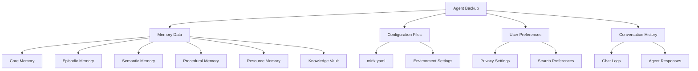

# Backup & Restore

Mirix provides built-in backup and restore functionality for your agent data, ensuring your memories and configurations are safe and portable.

## Overview

The backup system automatically handles both PostgreSQL and SQLite databases, preserving all your conversations, memories, and agent configurations in a portable format.

### What Gets Backed Up



## Prerequisites

### PostgreSQL Setup

Since backups use `pg_dump` to save the database, ensure PostgreSQL tools are accessible:

```bash
# macOS with Homebrew
export PATH="$(brew --prefix postgresql@17)/bin:$PATH"

# Verify pg_dump is available
which pg_dump
```

!!! warning "PATH Configuration Required"
    
    Without proper PATH configuration, backup operations will fail with "pg_dump: No such file or directory" error.

### Permissions

Ensure your user has proper database permissions:

```sql
-- Check current user permissions
SELECT current_user, current_database();

-- Verify backup permissions
SELECT has_database_privilege(current_user, current_database(), 'CONNECT');
```

## Creating Backups

### Basic Backup

```python
from mirix.agent import AgentWrapper

# Initialize agent
agent = AgentWrapper("./configs/mirix.yaml")

# Create backup
result = agent.save_agent("./my_backup")
print(result['message'])  # "Agent state saved successfully..."
```

### Advanced Backup Options

```python
# Backup with custom options
result = agent.save_agent(
    backup_path="./backups/mirix_backup_2024_03_15",
    include_logs=True,
    compress=True,
    verify_integrity=True
)

if result['success']:
    print(f"Backup created: {result['backup_path']}")
    print(f"Size: {result['size_mb']} MB")
    print(f"Files: {result['file_count']}")
else:
    print(f"Backup failed: {result['error']}")
```

### Automated Backup Schedule

```python
import schedule
import time
from datetime import datetime

def create_daily_backup():
    """Create daily backup with timestamp"""
    timestamp = datetime.now().strftime("%Y%m%d_%H%M%S")
    backup_path = f"./backups/daily_backup_{timestamp}"
    
    agent = AgentWrapper("./configs/mirix.yaml")
    result = agent.save_agent(backup_path)
    
    if result['success']:
        print(f"Daily backup created: {backup_path}")
        # Clean up old backups (keep last 7 days)
        cleanup_old_backups("./backups", days_to_keep=7)
    else:
        print(f"Backup failed: {result['error']}")

# Schedule daily backups
schedule.every().day.at("02:00").do(create_daily_backup)

# Keep scheduler running
while True:
    schedule.run_pending()
    time.sleep(60)
```

## Backup Structure

### Directory Layout

```
my_backup/
├── metadata.json           # Backup information and checksums
├── database/
│   ├── mirix_dump.sql     # PostgreSQL database dump
│   └── schema_info.json   # Database schema information
├── config/
│   ├── mirix.yaml         # Configuration file
│   └── environment.env    # Environment variables (sanitized)
├── memories/
│   ├── core_memory.json   # Core memory backup
│   ├── episodic_memory.json
│   ├── semantic_memory.json
│   ├── procedural_memory.json
│   ├── resource_memory.json
│   └── knowledge_vault.json
├── logs/
│   ├── agent.log          # Agent logs
│   └── security.log       # Security audit logs
└── verification/
    ├── checksums.md5      # File integrity checksums
    └── backup_report.txt  # Backup verification report
```

### Metadata Format

```json
{
  "backup_info": {
    "version": "1.0.0",
    "timestamp": "2024-03-15T14:30:00Z",
    "mirix_version": "2024.04.27",
    "database_type": "postgresql",
    "backup_size_bytes": 52428800,
    "file_count": 15
  },
  "checksums": {
    "database/mirix_dump.sql": "a1b2c3d4e5f6...",
    "config/mirix.yaml": "f6e5d4c3b2a1...",
    "memories/core_memory.json": "1a2b3c4d5e6f..."
  },
  "verification": {
    "integrity_check": "passed",
    "completeness_check": "passed",
    "compression_ratio": 0.65
  }
}
```

## Restoring from Backups

### Method 1: Restore During Initialization (Recommended)

```python
# Initialize agent with backup data
agent = AgentWrapper(
    config_path="./configs/mirix.yaml",
    load_from="./my_backup"
)

print("Agent restored from backup")
```

### Method 2: Load Backup After Creation

```python
# Create agent normally
agent = AgentWrapper("./configs/mirix.yaml")

# Then load backup data
result = agent.load_agent("./my_backup")

if result['success']:
    print(f"Backup restored successfully")
    print(f"Restored {result['memory_count']} memories")
    print(f"Restored {result['conversation_count']} conversations")
else:
    print(f"Restore failed: {result['error']}")
```

### Selective Restore

```python
# Restore only specific components
result = agent.load_agent(
    backup_path="./my_backup",
    restore_components={
        "memories": True,
        "conversations": True,
        "config": False,  # Keep current config
        "logs": False     # Skip logs
    }
)
```

## Backup Verification

### Integrity Checks

```python
def verify_backup(backup_path):
    """Verify backup integrity"""
    verification_results = {
        "file_integrity": check_file_checksums(backup_path),
        "database_integrity": verify_database_dump(backup_path),
        "memory_completeness": verify_memory_data(backup_path),
        "config_validity": verify_config_files(backup_path)
    }
    
    all_passed = all(verification_results.values())
    
    return {
        "valid": all_passed,
        "results": verification_results
    }

# Usage
backup_path = "./my_backup"
verification = verify_backup(backup_path)

if verification["valid"]:
    print("Backup verification passed")
else:
    print("Backup verification failed:")
    for check, result in verification["results"].items():
        if not result:
            print(f"  - {check}: FAILED")
```

### Automated Verification

```python
# Verify backup immediately after creation
result = agent.save_agent(
    backup_path="./verified_backup",
    verify_after_backup=True
)

if result['verification_passed']:
    print("Backup created and verified successfully")
else:
    print(f"Backup verification failed: {result['verification_errors']}")
```

## Migration Between Systems

### Export for Migration

```python
def export_for_migration(source_agent, export_path):
    """Export agent data for migration to new system"""
    
    # Create comprehensive backup
    backup_result = source_agent.save_agent(
        backup_path=export_path,
        include_logs=True,
        include_config=True,
        sanitize_sensitive=True  # Remove API keys, etc.
    )
    
    # Create migration guide
    migration_guide = {
        "source_system": get_system_info(),
        "mirix_version": get_mirix_version(),
        "database_type": get_database_type(),
        "migration_steps": [
            "1. Install Mirix on target system",
            "2. Configure database (PostgreSQL recommended)",
            "3. Set up environment variables",
            "4. Restore from this backup",
            "5. Verify all memories are accessible"
        ],
        "notes": [
            "API keys and sensitive data have been sanitized",
            "Update environment variables after restore",
            "Test search functionality after migration"
        ]
    }
    
    # Save migration guide
    with open(f"{export_path}/MIGRATION_GUIDE.json", "w") as f:
        json.dump(migration_guide, f, indent=2)
    
    return backup_result

# Usage
export_result = export_for_migration(agent, "./migration_export")
```

### Import on New System

```python
def import_from_migration(backup_path, new_config_path):
    """Import agent data on new system"""
    
    # Verify migration package
    if not verify_migration_package(backup_path):
        raise ValueError("Invalid migration package")
    
    # Initialize new agent with migrated data
    agent = AgentWrapper(
        config_path=new_config_path,
        load_from=backup_path
    )
    
    # Run post-migration verification
    verification_results = run_post_migration_tests(agent)
    
    return {
        "agent": agent,
        "verification": verification_results
    }

# Usage on new system
import_result = import_from_migration(
    backup_path="./migration_export",
    new_config_path="./configs/mirix.yaml"
)

if import_result["verification"]["all_passed"]:
    print("Migration completed successfully")
else:
    print("Migration completed with warnings:")
    for warning in import_result["verification"]["warnings"]:
        print(f"  - {warning}")
```

## Backup Management

### Cleanup Old Backups

```python
def cleanup_old_backups(backup_dir, days_to_keep=30):
    """Remove backups older than specified days"""
    import os
    import time
    from pathlib import Path
    
    backup_path = Path(backup_dir)
    current_time = time.time()
    cutoff_time = current_time - (days_to_keep * 24 * 60 * 60)
    
    removed_count = 0
    for backup_folder in backup_path.iterdir():
        if backup_folder.is_dir():
            folder_time = backup_folder.stat().st_mtime
            if folder_time < cutoff_time:
                shutil.rmtree(backup_folder)
                removed_count += 1
                print(f"Removed old backup: {backup_folder.name}")
    
    print(f"Cleaned up {removed_count} old backups")
    return removed_count

# Usage
cleanup_old_backups("./backups", days_to_keep=7)
```

### Backup Size Monitoring

```python
def monitor_backup_sizes(backup_dir):
    """Monitor backup sizes and growth"""
    import os
    from pathlib import Path
    
    backup_path = Path(backup_dir)
    backup_info = []
    
    for backup_folder in backup_path.iterdir():
        if backup_folder.is_dir():
            size = sum(f.stat().st_size for f in backup_folder.rglob('*') if f.is_file())
            backup_info.append({
                "name": backup_folder.name,
                "size_mb": size / (1024 * 1024),
                "created": backup_folder.stat().st_ctime
            })
    
    # Sort by creation time
    backup_info.sort(key=lambda x: x["created"])
    
    # Calculate growth trends
    if len(backup_info) > 1:
        avg_growth = (backup_info[-1]["size_mb"] - backup_info[0]["size_mb"]) / len(backup_info)
        print(f"Average backup size growth: {avg_growth:.2f} MB per backup")
    
    return backup_info

# Usage
backup_stats = monitor_backup_sizes("./backups")
for backup in backup_stats[-5:]:  # Show last 5 backups
    print(f"{backup['name']}: {backup['size_mb']:.2f} MB")
```

## Troubleshooting

### Common Backup Issues

!!! failure "\"pg_dump: No such file or directory\" error"
    
    PostgreSQL tools are not in your PATH:
    ```bash
    # Add PostgreSQL to PATH
    export PATH="$(brew --prefix postgresql@17)/bin:$PATH"
    
    # Add to your shell profile for persistence
    echo 'export PATH="$(brew --prefix postgresql@17)/bin:$PATH"' >> ~/.zshrc
    ```

!!! failure "\"Permission denied\" during backup"
    
    Check database permissions:
    ```sql
    -- Connect to your database
    psql -U $(whoami) -d mirix
    
    -- Check permissions
    \du
    ```

!!! failure "Backup corruption or incomplete"
    
    Verify backup integrity:
    ```python
    verification = verify_backup("./my_backup")
    if not verification["valid"]:
        print("Backup is corrupted, create a new one")
        result = agent.save_agent("./new_backup", verify_after_backup=True)
    ```

!!! failure "Restore fails with version mismatch"
    
    Check Mirix version compatibility:
    ```python
    # Check backup version
    with open("./my_backup/metadata.json") as f:
        metadata = json.load(f)
        backup_version = metadata["backup_info"]["mirix_version"]
        print(f"Backup version: {backup_version}")
        print(f"Current version: {get_mirix_version()}")
    ```

### Recovery Strategies  

#### Partial Restore

```python
def recover_specific_memories(backup_path, memory_types):
    """Recover only specific memory types"""
    
    agent = AgentWrapper("./configs/mirix.yaml")
    
    for memory_type in memory_types:
        memory_file = f"{backup_path}/memories/{memory_type}_memory.json"
        if os.path.exists(memory_file):
            with open(memory_file) as f:
                memory_data = json.load(f)
            
            # Restore this memory type
            agent.restore_memory_type(memory_type, memory_data)
            print(f"Restored {memory_type} memory")
    
    return agent

# Usage - recover only core and semantic memories
agent = recover_specific_memories(
    "./my_backup", 
    ["core", "semantic"]
)
```

#### Database Recovery

```python
def recover_database_only(backup_path):
    """Recover only database without memory processing"""
    
    dump_file = f"{backup_path}/database/mirix_dump.sql"
    
    if os.path.exists(dump_file):
        # Restore database
        os.system(f"psql -U $(whoami) -d mirix < {dump_file}")
        print("Database restored from dump")
    else:
        print("No database dump found in backup")
```

## Best Practices

### Backup Strategy

1. **Regular Backups**: Create automated daily backups
2. **Multiple Locations**: Store backups in different locations
3. **Version Control**: Keep multiple backup versions
4. **Verification**: Always verify backup integrity
5. **Testing**: Regularly test restore procedures

### Backup Frequency Recommendations

| Usage Pattern | Backup Frequency | Retention |
|---------------|------------------|-----------|
| Light usage (< 100 screenshots/day) | Weekly | 4 weeks |
| Medium usage (100-500 screenshots/day) | Daily | 2 weeks |
| Heavy usage (> 500 screenshots/day) | Twice daily | 1 week |
| Critical workflows | After each session | 30 days |

### Security Considerations

```python
# Secure backup practices
def create_secure_backup(agent, backup_path, encryption_key=None):
    """Create encrypted backup"""
    
    # Create backup
    result = agent.save_agent(backup_path, sanitize_sensitive=True)
    
    if encryption_key and result['success']:
        # Encrypt sensitive files
        encrypt_backup_files(backup_path, encryption_key)
        
        # Remove unencrypted sensitive data
        remove_plaintext_sensitive(backup_path)
    
    return result
```

The backup and restore system ensures your Mirix memories and configurations are always safe and portable across different systems and installations.

## What's Next?

Learn about performance optimization:

[**Performance →**](performance.md){ .md-button .md-button--primary }

Or explore the complete API reference:

[**API Reference →**](../api/agent-api.md){ .md-button } 