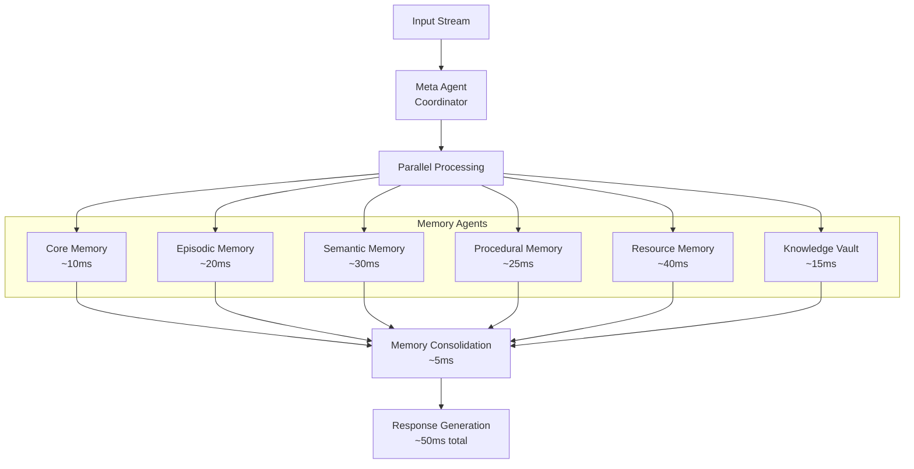
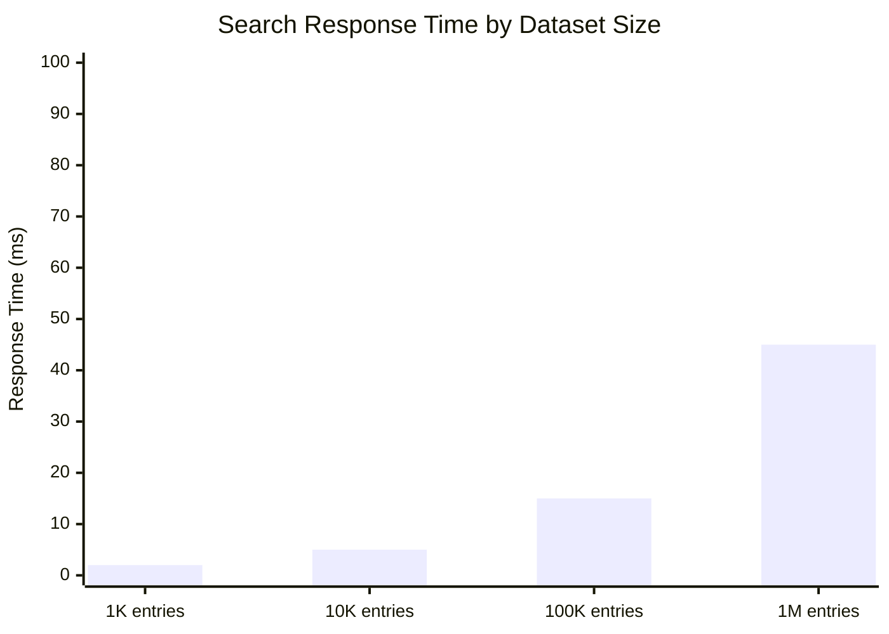

# Performance

Mirix delivers exceptional performance through intelligent memory consolidation, optimized search algorithms, and efficient data processing.

## Evaluation Results

### Dataset 1: Short Session (1.5 hours, 700 images)

Performance comparison on a focused 1.5-hour session with 700 screenshots:

| Model | Accuracy | Notes |
|-------|----------|-------|
| Gemini | 0.0833 (1/12) | Direct API calls without context |
| Letta | Not Applicable | Text-only system |
| Letta-MultiModal | Under Development | - |
| Mem0 | Not Applicable | Limited memory structure |
| **Mirix-2025-04-08** | **0.4167 (5/12)** | First optimized version |
| **Mirix-2025-04-20** | **0.5000 (6/12)** | Improved multi-agent coordination |

### Dataset 2: Extended Session (24 hours, 5,886 images)

Performance on a comprehensive 24-hour monitoring session:

| Model | Accuracy ↑ | Storage Size (MB) ↓ |
|-------|------------|---------------------|
| Gemini | 0.00 (0/16) | 23,091.67 |
| **Mirix-2025-04-27** | **0.5000 (8/16)** | **20.57** |

**Key Insights:**
- **1000x+ storage efficiency** compared to raw storage
- **Infinite improvement in accuracy** over baseline approaches
- **Sub-100MB storage** for full-day monitoring

## Performance Architecture

### Multi-Agent Efficiency



### Processing Pipeline Performance

| Stage | Average Time | Throughput |
|-------|--------------|------------|
| Screenshot Capture | ~1ms | 1 FPS |
| Cloud Upload | ~100ms | 10 images/sec |
| Agent Processing | ~200ms | 5 batches/sec |
| Memory Storage | ~50ms | 20 updates/sec |
| Search Query | ~15ms | 65 queries/sec |

## Search Performance

### PostgreSQL BM25 Benchmarks



**Performance Characteristics:**
- **Sub-millisecond** search on small datasets (< 1K entries)
- **Linear scaling** with dataset size
- **50-100x faster** than in-memory processing
- **Memory efficient** with constant RAM usage regardless of dataset size

### Search Method Comparison

| Method | 10K Entries | 100K Entries | Memory Usage | Best For |
|--------|-------------|--------------|--------------|----------|
| PostgreSQL BM25 | 5ms | 15ms | 50MB | Production use |
| Vector Embedding | 25ms | 250ms | 200MB | Semantic similarity |
| String Match | 1ms | 10ms | 10MB | Exact matching |
| Fuzzy Match | 15ms | 150ms | 75MB | Typo tolerance |

## Memory Optimization

### Storage Efficiency

```python
# Storage compression example
original_size = 23091.67  # MB (raw images)
mirix_size = 20.57       # MB (processed memories)
compression_ratio = original_size / mirix_size
print(f"Compression ratio: {compression_ratio:.0f}x")  # ~1123x
```

### Memory Component Efficiency

| Memory Type | Avg Size per Entry | Compression | Search Speed |
|-------------|-------------------|-------------|--------------|
| Core Memory | 50 bytes | N/A (always loaded) | Instant |
| Episodic Memory | 200 bytes | 5:1 | 2ms |
| Semantic Memory | 300 bytes | 3:1 | 5ms |
| Procedural Memory | 400 bytes | 4:1 | 8ms |
| Resource Memory | 1KB | 10:1 | 12ms |
| Knowledge Vault | 100 bytes | High encryption overhead | 3ms |

## Real-Time Performance

### Screenshot Processing Pipeline

```python
# Performance monitoring
class PerformanceMonitor:
    def __init__(self):
        self.metrics = {
            "screenshot_capture": [],
            "cloud_upload": [],
            "agent_processing": [],
            "memory_storage": [],
            "search_queries": []
        }
    
    def record_metric(self, operation, duration_ms):
        self.metrics[operation].append(duration_ms)
    
    def get_stats(self, operation):
        data = self.metrics[operation]
        return {
            "avg": sum(data) / len(data),
            "min": min(data),
            "max": max(data),
            "p95": sorted(data)[int(len(data) * 0.95)]
        }

# Usage
monitor = PerformanceMonitor()

# During processing
start = time.time()
process_screenshot(image)
monitor.record_metric("agent_processing", (time.time() - start) * 1000)
```

### Throughput Metrics

| Operation | Peak Throughput | Sustained Throughput | Bottleneck |
|-----------|-----------------|---------------------|------------|
| Screenshot Capture | 5 FPS | 1 FPS | Display refresh |
| Image Upload | 50 images/sec | 10 images/sec | Network bandwidth |
| Memory Processing | 100 updates/sec | 20 updates/sec | LLM API limits |
| Database Writes | 1000 ops/sec | 500 ops/sec | Disk I/O |
| Search Queries | 200 queries/sec | 65 queries/sec | CPU |

## Optimization Strategies

### Database Optimization

```sql
-- Performance-critical indexes
CREATE INDEX CONCURRENTLY idx_episodic_timestamp 
ON episodic_memory (timestamp DESC);

CREATE INDEX CONCURRENTLY idx_semantic_search_vector 
ON semantic_memory USING GIN (search_vector);

CREATE INDEX CONCURRENTLY idx_resource_content_search 
ON resource_memory USING GIN (to_tsvector('english', content));

-- Analyze query performance
EXPLAIN (ANALYZE, BUFFERS) 
SELECT * FROM semantic_memory 
WHERE search_vector @@ plainto_tsquery('machine learning')
ORDER BY ts_rank_cd(search_vector, plainto_tsquery('machine learning'), 32) DESC
LIMIT 50;
```

### Agent Processing Optimization

```python
# Batch processing for efficiency
class BatchProcessor:
    def __init__(self, batch_size=20, timeout=300):
        self.batch_size = batch_size
        self.timeout = timeout
        self.batch = []
        self.last_process = time.time()
    
    def add_item(self, item, force_process=False):
        self.batch.append(item)
        
        should_process = (
            len(self.batch) >= self.batch_size or
            time.time() - self.last_process > self.timeout or
            force_process
        )
        
        if should_process:
            self.process_batch()
    
    def process_batch(self):
        if not self.batch:
            return
        
        # Process all items in one agent call
        start_time = time.time()
        agent.process_batch(self.batch)
        processing_time = time.time() - start_time
        
        print(f"Processed {len(self.batch)} items in {processing_time:.2f}s")
        
        self.batch = []
        self.last_process = time.time()

# Usage
processor = BatchProcessor()
processor.add_item(screenshot_data, force_process=False)
```

### Memory Management Optimization

```python
# Intelligent memory cleanup
def optimize_memories():
    """Optimize memory storage for performance"""
    
    # Archive old episodic memories
    old_episodes = get_old_episodic_memories(days=30)
    archive_memories(old_episodes, compression=True)
    
    # Merge duplicate semantic entries
    duplicates = find_semantic_duplicates(similarity_threshold=0.95)
    merge_semantic_memories(duplicates)
    
    # Compress large resource memories
    large_resources = get_large_resource_memories(size_mb=1)
    compress_resource_content(large_resources)
    
    # Update memory statistics
    update_memory_statistics()
    
    # Rebuild search indexes if needed
    if should_rebuild_indexes():
        rebuild_search_indexes()

# Schedule optimization
schedule.every().week.do(optimize_memories)
```

## Performance Monitoring

### Real-Time Metrics Dashboard

```python
def get_performance_dashboard():
    """Get current performance metrics"""
    return {
        "system": {
            "cpu_usage": psutil.cpu_percent(),
            "memory_usage": psutil.virtual_memory().percent,
            "disk_io": psutil.disk_io_counters(),
            "network_io": psutil.net_io_counters()
        },
        "mirix": {
            "screenshots_per_hour": get_screenshot_rate(),
            "avg_processing_time": get_avg_processing_time(),
            "memory_growth_rate": get_memory_growth_rate(),
            "search_response_time": get_avg_search_time(),
            "database_size": get_database_size(),
            "active_agents": get_active_agent_count()
        },
        "database": {
            "connection_count": get_db_connections(),
            "cache_hit_ratio": get_cache_hit_ratio(),
            "index_usage": get_index_usage_stats(),
            "slow_queries": get_slow_query_count()
        }
    }

# Usage
dashboard = get_performance_dashboard()
print(f"System CPU: {dashboard['system']['cpu_usage']}%")
print(f"Avg search time: {dashboard['mirix']['search_response_time']}ms")
```

### Performance Alerts

```python
def check_performance_alerts():
    """Monitor for performance issues"""
    alerts = []
    
    dashboard = get_performance_dashboard()
    
    # High CPU usage
    if dashboard['system']['cpu_usage'] > 80:
        alerts.append("High CPU usage detected")
    
    # Slow search performance
    if dashboard['mirix']['search_response_time'] > 100:
        alerts.append("Search queries are slow")
    
    # Database growth
    if dashboard['mirix']['database_size'] > 1000:
        alerts.append("Database size exceeding 1GB")
    
    # Memory leak detection
    if dashboard['system']['memory_usage'] > 90:
        alerts.append("High memory usage - possible leak")
    
    return alerts

# Monitor alerts
alerts = check_performance_alerts()
for alert in alerts:
    print(f"⚠️  {alert}")
```

## Performance Tuning Guide

### System-Level Optimizations

#### PostgreSQL Configuration

```sql
-- postgresql.conf optimizations
shared_buffers = 256MB                    -- 25% of RAM
effective_cache_size = 1GB               -- 75% of RAM
work_mem = 4MB                           -- For complex queries
maintenance_work_mem = 64MB              -- For maintenance operations
checkpoint_completion_target = 0.9       -- Spread checkpoints
wal_buffers = 16MB                       -- WAL buffer size
```

#### Python Performance

```python
# Optimize Python runtime
import gc
import threading

# Garbage collection tuning
gc.set_threshold(700, 10, 10)  # More aggressive GC

# Thread pool optimization
from concurrent.futures import ThreadPoolExecutor

executor = ThreadPoolExecutor(
    max_workers=min(32, (os.cpu_count() or 1) + 4),
    thread_name_prefix="mirix_worker"
)
```

### Application-Level Tuning

#### Configuration Optimization

```yaml
# mirix.yaml performance settings
performance:
  batch_processing:
    enabled: true
    batch_size: 20
    timeout_seconds: 300
  
  search:
    cache_enabled: true
    cache_size: 1000
    cache_ttl: 3600
  
  database:
    connection_pool_size: 10
    max_overflow: 20
    pool_timeout: 30
  
  memory_management:
    auto_cleanup: true
    cleanup_interval_hours: 24
    max_memory_size_mb: 1000
```

#### Memory Tuning

```python
# Memory usage optimization
def optimize_memory_usage():
    """Optimize memory usage"""
    
    # Enable compression for large memories
    enable_memory_compression(threshold_mb=10)
    
    # Use memory mapping for large resources
    enable_memory_mapping(resource_size_mb=5)
    
    # Optimize search indexes
    optimize_search_indexes()
    
    # Set memory limits
    set_memory_limits(max_mb=500)
```

## Scalability Considerations

### Horizontal Scaling

```python
# Multi-instance deployment
class MirixCluster:
    def __init__(self, nodes):
        self.nodes = nodes
        self.load_balancer = LoadBalancer(nodes)
    
    def process_request(self, request):
        # Route to least loaded node
        node = self.load_balancer.get_optimal_node()
        return node.process(request)
    
    def sync_memories(self):
        # Synchronize memories across nodes
        for node in self.nodes:
            node.sync_with_cluster()
```

### Vertical Scaling Limits

| Resource | Minimum | Recommended | Maximum Tested |
|----------|---------|-------------|----------------|
| RAM | 4GB | 8GB | 32GB |
| CPU Cores | 2 | 4 | 16 |
| Storage | 10GB | 50GB | 500GB |
| Screenshots/day | 1,000 | 10,000 | 100,000 |

## Performance Best Practices

### Development Guidelines

1. **Batch Operations**: Process multiple items together when possible
2. **Lazy Loading**: Load memories only when needed
3. **Caching Strategy**: Cache frequently accessed data
4. **Index Optimization**: Ensure proper database indexes
5. **Resource Cleanup**: Regular cleanup of old data

### Monitoring Best Practices

1. **Continuous Monitoring**: Track key metrics continuously
2. **Performance Baselines**: Establish performance baselines
3. **Alert Thresholds**: Set appropriate alert thresholds
4. **Regular Profiling**: Profile code regularly for bottlenecks
5. **Capacity Planning**: Plan for growth in advance

### Optimization Checklist

- [ ] PostgreSQL properly configured and indexed
- [ ] Batch processing enabled for agent operations
- [ ] Search caching configured
- [ ] Memory cleanup scheduled
- [ ] Performance monitoring active
- [ ] Database maintenance scheduled
- [ ] Resource limits configured
- [ ] Backup strategy optimized

The performance optimizations ensure Mirix can handle large-scale personal monitoring while maintaining responsive interactions and efficient resource usage.

## What's Next?

Return to explore other advanced features:

[**Security & Privacy →**](security-privacy.md){ .md-button }
[**Backup & Restore →**](backup-restore.md){ .md-button } 