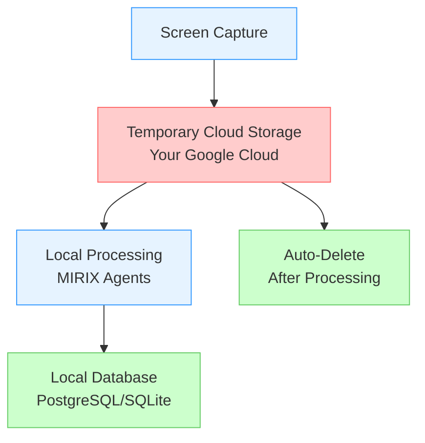
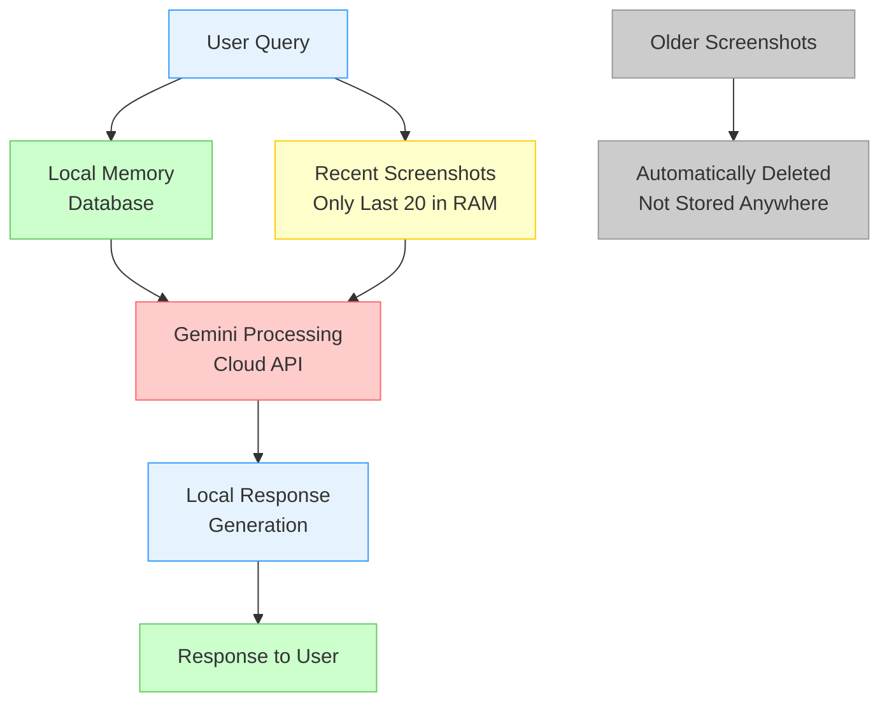

# Security & Privacy

MIRIX is designed with privacy and security as core principles. All sensitive data processing happens locally, with user-controlled privacy settings and enterprise-grade security practices.

## Privacy Architecture

### Data Flow Overview

#### Memory Updates Workflow



#### Query Response Workflow



### Privacy Principles

1. **Local Data Storage**: All long-term user data remains on your local machine
2. **User-Controlled Cloud**: Only your personal Google Cloud account is used for temporary storage
3. **Automatic Cleanup**: Screenshots are automatically deleted after processing
4. **No Third-Party Sharing**: Your data never leaves your control
5. **Transparent Processing**: All data processing is documented and auditable

## Screenshot Handling

### Capture Process

```python
# MIRIX screenshot workflow
def screenshot_workflow():
    # 1. Capture screenshot every second
    screenshot = capture_screen()
    
    # 2. Upload to YOUR Google Cloud storage
    upload_to_user_cloud(screenshot, user_bucket)
    
    # 3. Keep only recent 600 screenshots (~10 minutes)
    maintain_recent_screenshots(limit=600)
    
    # 4. Process screenshots through agents
    process_with_agents(screenshot)
    
    # 5. Delete processed screenshots
    delete_processed_screenshots()
```

## What's Next?

Explore backup and restore features:

[**Backup & Restore →**](backup-restore.md){ .md-button } 