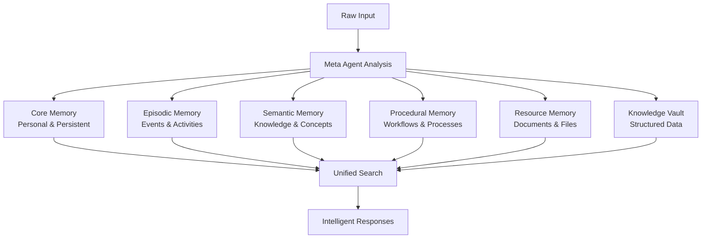
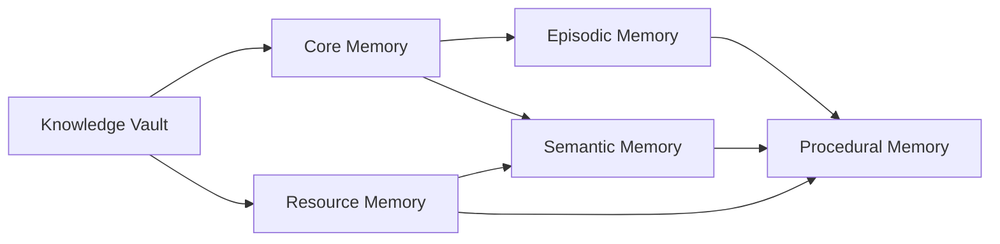

# Memory Components

MIRIX organizes information into six distinct memory components, each designed to handle specific types of data and provide optimal retrieval performance.

## Memory Architecture Overview



## 1. Core Memory

**Purpose**: Persistent information that should always be visible to the agent when interacting with the user.

**Inspired by**: MemGPT's core memory architecture

### Structure

Core Memory is organized in multiple blocks with line indicators:

```
Line 1: User's name is David
Line 2: User prefers coffee over tea
Line 3: User works as a software engineer
Line 4: User enjoys reading sci-fi novels
...
```

### Key Features

- **Persistent Visibility**: Always available during conversations
- **Two Main Blocks**:
  - `persona`: The agent's personality and behavior
  - `human`: Saved understanding of the user
- **Auto-Rewriting**: When blocks exceed 90% capacity, they are automatically rewritten to maintain optimal size
- **Essential Information**: Stores critical facts that define the user-agent relationship

### Example Content

```
=== PERSONA ===
Line 1: I am MIRIX, a helpful AI assistant specializing in memory management
Line 2: I track user activities and provide context-aware assistance
Line 3: I maintain detailed memories of user interactions and preferences

=== HUMAN ===
Line 1: User's name is Sarah, works as a data scientist
Line 2: User prefers PostgreSQL over SQLite for databases
Line 3: User is currently working on a machine learning project
Line 4: User has meetings every Tuesday at 2 PM
```

## 2. Episodic Memory

**Purpose**: Captures context-specific events and temporal activities, serving as a summarization or calendar of user behaviors.

### Structure

Each episodic entry contains:

```json
{
  "event_type": "user_message",
  "summary": "User reviewed quarterly sales report",
  "details": "Detailed analysis of Q3 sales performance, identified key growth areas in mobile segment, discussed strategies with marketing team",
  "actor": "user",
  "timestamp": "2025-03-05 10:15"
}
```

### Event Types

- `user_message`: Direct user communications
- `inferred_results`: System-inferred activities from screen capture
- `system_notification`: Automated system events
- `workflow_completion`: Completed task sequences

### Example Entries

```json
[
  {
    "event_type": "user_message",
    "summary": "Started working on documentation",
    "details": "Opened VSCode, created new markdown files for project documentation, began writing API specifications",
    "actor": "user",
    "timestamp": "2025-03-05 09:30"
  },
  {
    "event_type": "inferred_results",
    "summary": "Switched to email client",
    "details": "Closed development environment, opened Gmail, reviewed 5 new emails, responded to client inquiry about project timeline",
    "actor": "assistant",
    "timestamp": "2025-03-05 10:45"
  }
]
```

## 3. Semantic Memory

**Purpose**: Maintains general knowledge, concepts, and abstracted information independent of temporal context.

### Structure

Each semantic entry includes:

```json
{
  "name": "PostgreSQL",
  "summary": "Open-source relational database management system",
  "details": "Powerful, enterprise-grade database with advanced features like JSONB support, full-text search, and vector extensions. Preferred by user for its performance and reliability.",
  "source": "user_interaction"
}
```

### Content Types

- **Factual Knowledge**: "Harry Potter is written by J.K. Rowling"
- **Relationships**: "John is a good friend who likes jogging"
- **Concepts**: "Machine learning algorithms and their applications"
- **Preferences**: "User prefers dark mode in development environments"

### Example Entries

```json
[
  {
    "name": "MkDocs Material",
    "summary": "Documentation framework based on MkDocs",
    "details": "Static site generator that creates beautiful documentation sites from Markdown files. Features include responsive design, search functionality, and extensive customization options.",
    "source": "documentation_project"
  },
  {
    "name": "Team Standup Meeting",
    "summary": "Daily team synchronization meeting",
    "details": "Occurs every weekday at 9 AM, attended by development team to discuss progress, blockers, and daily goals. Usually lasts 15-20 minutes.",
    "source": "recurring_activity"
  }
]
```

## 4. Procedural Memory

**Purpose**: Records process workflows and step-by-step instructions for accomplishing specific tasks.

### Structure

Each procedural entry contains:

```json
{
  "entry_type": "workflow",
  "description": "Deploy application to production",
  "steps": [
    "1. Run test suite to ensure all tests pass",
    "2. Create production build with 'npm run build'",
    "3. Review build artifacts for any issues",
    "4. Deploy to staging environment first",
    "5. Perform smoke tests on staging",
    "6. Deploy to production using CI/CD pipeline",
    "7. Monitor application metrics post-deployment"
  ]
}
```

### Entry Types

- `workflow`: Multi-step processes
- `guide`: How-to instructions
- `script`: Automated procedures

### Example Entries

```json
[
  {
    "entry_type": "workflow",
    "description": "Setting up new development environment",
    "steps": [
      "1. Install Python 3.11 or later",
      "2. Set up virtual environment with 'python -m venv venv'",
      "3. Activate virtual environment",
      "4. Install dependencies with 'pip install -r requirements.txt'",
      "5. Configure environment variables in .env file",
      "6. Initialize database with 'python manage.py migrate'",
      "7. Run development server with 'python manage.py runserver'"
    ]
  },
  {
    "entry_type": "guide",
    "description": "Troubleshooting PostgreSQL connection issues",
    "steps": [
      "1. Check if PostgreSQL service is running",
      "2. Verify database exists with 'psql -l'",
      "3. Test connection with 'psql -U username -d database'",
      "4. Check firewall settings if connecting remotely",
      "5. Verify authentication configuration in pg_hba.conf"
    ]
  }
]
```

## 5. Resource Memory

**Purpose**: Manages active documents and project-related files that the user interacts with.

### Structure

Each resource entry includes:

```json
{
  "title": "Project Proposal - Q4 2024",
  "summary": "Comprehensive proposal for new mobile application development project including timeline, budget, and technical specifications",
  "resource_type": "pdf_text",
  "content": "# Project Proposal\n\n## Executive Summary\nThis proposal outlines the development of a new mobile application...\n\n## Technical Requirements\n- React Native framework\n- PostgreSQL database\n- AWS cloud infrastructure..."
}
```

### Resource Types

- `doc`: Microsoft Word documents
- `markdown`: Markdown files
- `pdf_text`: Extracted text from PDFs
- `image`: Image files with descriptions
- `voice_transcript`: Transcribed audio content
- `code`: Source code files
- `spreadsheet`: Excel/CSV data

### Example Entries

```json
[
  {
    "title": "API Documentation Draft",
    "summary": "Initial draft of REST API documentation for the customer management system, includes endpoint specifications and example requests",
    "resource_type": "markdown",
    "content": "# Customer Management API\n\n## Overview\nThis API provides endpoints for managing customer data...\n\n## Endpoints\n\n### GET /api/customers\nRetrieve list of customers..."
  },
  {
    "title": "Meeting Recording - Sprint Planning",
    "summary": "Voice recording from sprint planning meeting discussing user stories and development priorities for next iteration",
    "resource_type": "voice_transcript",
    "content": "Transcript: 'Let's start with the user authentication story. Based on our previous discussion, we need to implement OAuth 2.0 integration...'"
  }
]
```

## 6. Knowledge Vault

**Purpose**: Securely stores structured personal data such as addresses, phone numbers, contacts, and credentials.

### Structure

Each vault entry contains:

```json
{
  "entry_type": "credential",
  "source": "github",
  "sensitivity": "high",
  "secret_value": "ghp_xxxxxxxxxxxxxxxxxxxx",
  "caption": "GitHub Personal Access Token for API access"
}
```

### Entry Types

- `credential`: Login information and tokens
- `bookmark`: Important URLs and links
- `api_key`: Service API keys and secrets
- `contact_info`: Personal contact information

### Sensitivity Levels

- `low`: General bookmarks and public information
- `medium`: Contact information and non-critical data
- `high`: Passwords, API keys, and sensitive credentials

### Security Features

- **Encryption**: Sensitive data encrypted at rest
- **Access Control**: Restricted access based on sensitivity level
- **Audit Trail**: All access to sensitive data is logged
- **Automatic Expiration**: Credentials can have expiration dates

### Example Entries

```json
[
  {
    "entry_type": "api_key",
    "source": "openai",
    "sensitivity": "high",
    "secret_value": "sk-proj-xxxxxxxxxxxxxxxxxxxx",
    "caption": "OpenAI API key for ChatGPT integration"
  },
  {
    "entry_type": "bookmark",
    "source": "user_provided",
    "sensitivity": "low",
    "secret_value": "https://docs.mirix.ai/",
    "caption": "MIRIX documentation website"
  },
  {
    "entry_type": "contact_info",
    "source": "user_profile",
    "sensitivity": "medium",
    "secret_value": "john.doe@example.com",
    "caption": "Primary email address"
  }
]
```

## Memory Interaction Patterns

### Cross-Memory Relationships



### Search Integration

All memory components support unified search:

```python
# Search across all memory types
results = search_memory(
    query="machine learning project",
    memory_types=["core", "episodic", "semantic", "procedural", "resource"],
    limit=20
)
```

## Memory Optimization

### Automatic Cleanup

- **Core Memory**: Rewrites blocks when approaching capacity
- **Episodic Memory**: Archives old entries based on relevance
- **Semantic Memory**: Merges duplicate concepts
- **Procedural Memory**: Updates workflows based on usage patterns
- **Resource Memory**: Compresses or removes unused resources
- **Knowledge Vault**: Expires outdated credentials

### Performance Tuning

- **Indexing**: Optimized database indexes for fast retrieval
- **Caching**: Frequently accessed data cached in memory
- **Compression**: Large content compressed to save space
- **Partitioning**: Data partitioned by date and type for efficient queries

## Best Practices

### Memory Organization

1. **Keep Core Memory Concise**: Only essential, persistent information
2. **Detailed Episodic Entries**: Rich context for better retrieval
3. **Abstract Semantic Concepts**: Focus on reusable knowledge
4. **Actionable Procedures**: Clear, step-by-step instructions
5. **Comprehensive Resources**: Full content for better context
6. **Secure Vault Management**: Proper sensitivity classification

### Search Optimization

- Use specific queries for better results
- Combine memory types for comprehensive answers
- Leverage field-specific search when needed
- Regular memory cleanup for optimal performance

## What's Next?

Learn about MIRIX's advanced search capabilities:

[**Search Capabilities →**](search-capabilities.md){ .md-button .md-button--primary } 