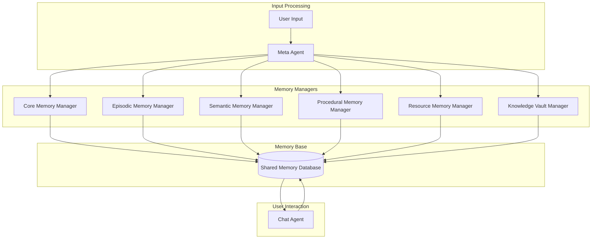
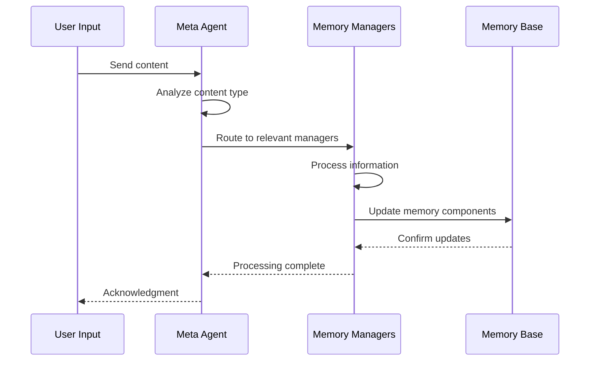
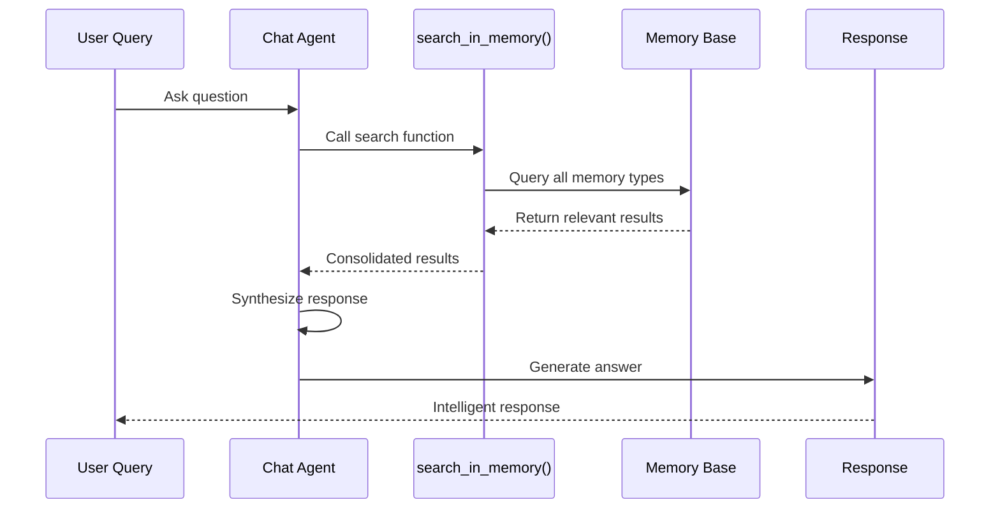

# Multi-Agent System

MIRIX consists of eight specialized agents that work collaboratively to process your digital activities and manage memory efficiently.

## Agent Overview



## Agent Roles

### :material-account-supervisor: Meta Agent

**Role**: Central coordinator and content analyzer

**Responsibilities**:

- Analyzes incoming user content (text, images, voice)
- Determines which memory components need updates
- Routes the input content to relevant Memory Managers

**Workflow**:
```python
# Pseudo-code for Meta Agent processing
def trigger_memory_update(self: "Agent", user_message: object, memory_types: List[str]) -> Optional[str]:
    """
    Choose which memory to update. This function will trigger another memory agent which is specifically in charge of handling the corresponding memory to update its memory. Trigger all necessary memory updates at once. 

    Args:
        memory_types (List[str]): The types of memory to update. It should be chosen from the following: "core", "episodic", "resource", "procedural", "knowledge_vault", "semantic". For instance, ['episodic', 'resource'].
    """
    
    # ... and so on
```

### :material-chat: Chat Agent

**Role**: Natural language conversation interface

**Responsibilities**:
- Handles user queries and conversations
- Searches across all memory components using `search_in_memory()`
- Synthesizes retrieved information into contextual responses
- Maintains conversation flow and context

**Search Process**:
```python
def search_in_memory(self: "Agent", memory_type: str, query: str, search_field: str, search_method: str, timezone_str: str) -> Optional[str]:
    """
    Choose which memory to search. All memory types support multiple search methods with different performance characteristics. Most of the time, you should use search over 'details' for episodic memory and semantic memory, 'content' for resource memory (but for resource memory, `embedding` is not supported for content field so you have to use other search methods), 'description' for procedural memory. This is because these fields have the richest information and is more likely to contain the keywords/query. You can always start from a thorough search over the whole memory by setting memory_type as 'all' and search_field as 'null', and then narrow down to specific fields and specific memories.
    
    Args:
        memory_type: The type of memory to search in. It should be chosen from the following: "episodic", "resource", "procedural", "knowledge_vault", "semantic", "all". Here "all" means searching in all the memories. 
        query: The keywords/query used to search in the memory.        
        search_field: The field to search in the memory. It should be chosen from the attributes of the corresponding memory. For "episodic" memory, it can be 'summary', 'details'; for "resource" memory, it can be 'summary', 'content'; for "procedural" memory, it can be 'summary', 'steps'; for "knowledge_vault", it can be 'secret_value', 'caption'; for semantic memory, it can be 'name', 'summary', 'details'. For "all", it should also be "null" as the system will search all memories with default fields. 
        search_method: The method to search in the memory. Choose from:
            - 'bm25': BM25 ranking-based full-text search (fast and effective for keyword-based searches)
            - 'embedding': Vector similarity search using embeddings (most powerful, good for conceptual matches)
            - 'string_match': Exact string match, can be used when you need to locate or compare text that must match exactly, character for character.
    
    Returns:
        str: Query result string
    """
```

## Memory Managers

Each memory component has a dedicated agent that specializes in managing that specific type of information.

### :material-account-heart: Core Memory Manager

**Manages**: Personal preferences, user identity, essential facts

**Processing Logic**:

- Identifies user preferences and personality traits
- Updates persona and human understanding blocks
- Maintains consistency across conversations
- Handles memory rewriting when blocks exceed 90% capacity

### :material-calendar-clock: Episodic Memory Manager

**Manages**: Time-based activities and events

**Processing Logic**:

- Captures temporal context and user activities
- Creates event summaries with timestamps
- Tracks what the user has done and is currently doing

### :material-brain: Semantic Memory Manager

**Manages**: General knowledge and concepts about people and the world

**Processing Logic**:

- Extracts factual information independent of time
- Stores concepts, definitions, and relationships
- Maintains knowledge about people, places, and things
- Links related concepts for better retrieval

### :material-clipboard-list: Procedural Memory Manager

**Manages**: Workflows and step-by-step processes

**Processing Logic**:

- Identifies process patterns and workflows
- Stores step-by-step instructions
- Recognizes recurring task patterns

### :material-file-document: Resource Memory Manager

**Manages**: Documents, files, and content

**Processing Logic**:

- Processes document content and context
- Stores full or partial content as needed

### :material-key: Knowledge Vault Manager

**Manages**: Structured data and credentials

**Processing Logic**:

- Identifies sensitive information (passwords, API keys)
- Categorizes data by sensitivity level (`sensitivity` as `[low, medium, high]`)
- Maintains secure storage practices
- Prevents accidental exposure of `high` sensitivity data

## Workflow Coordination

### 1. Input Processing Pipeline



### 2. Memory Consolidation Process

**Batch Processing**:

- Agents accumulate information until reaching threshold
- Trigger parallel processing for efficiency
- Single function call per agent for comprehensive updates

**Smart Routing**:

- Meta Agent analyze the content to determine distribution, preventing unnecessary processing and maintaining efficiency
- (Double Check) The specific memory manager can skip updates if no relevant information detected

### 3. Conversational Retrieval System



## Performance Optimizations

### Concurrent Processing

- Memory Managers work independently but share the same memory base
- Parallel processing of different memory types

### Single Function Call Architecture

- Each agent makes comprehensive updates in a single function call
- Reduces database round trips and improves performance
- Maintains consistency across memory components

## Error Handling and Resilience

### Graceful Degradation

- Agents can skip updates if processing fails
- System continues operating even if individual agents encounter errors
- Automatic retry mechanisms for transient failures

### Data Consistency

- Shared memory base ensures consistency across agents
- Transaction-based updates prevent data corruption
- Automatic rollback on processing failures

## What's Next?

Dive deeper into the memory components that power this system:

[**Memory Components →**](memory-components.md){ .md-button .md-button--primary } 