# Multi-Agent System

MIRIX consists of eight specialized agents that work collaboratively to process your digital activities and manage memory efficiently.

## Agent Overview


## Agent Roles

### :material-account-supervisor: Meta Agent

**Role**: Central coordinator and content analyzer

**Responsibilities**:
- Analyzes incoming user content (text, images, voice)
- Determines which memory components need updates
- Routes specific instructions to relevant Memory Managers
- Orchestrates the overall information processing workflow

**Workflow**:
```python
# Pseudo-code for Meta Agent processing
def process_user_input(content):
    analysis = analyze_content(content)
    
    if contains_personal_info(analysis):
        route_to_core_memory_manager(analysis)
    
    if contains_activities(analysis):
        route_to_episodic_memory_manager(analysis)
    
    if contains_knowledge(analysis):
        route_to_semantic_memory_manager(analysis)
    
    # ... and so on
```

### :material-chat: Chat Agent

**Role**: Natural language conversation interface

**Responsibilities**:
- Handles user queries and conversations
- Searches across all memory components using `search_memory()`
- Synthesizes retrieved information into contextual responses
- Maintains conversation flow and context

**Search Process**:
```python
def respond_to_query(user_query):
    # Search across all memory types
    search_results = search_memory(
        query=user_query,
        search_across=['core', 'episodic', 'semantic', 
                      'procedural', 'resource', 'vault']
    )
    
    # Generate contextual response
    return synthesize_response(search_results, user_query)
```

## Memory Management Agents

Each memory component has a dedicated agent that specializes in managing that specific type of information.

### :material-account-heart: Core Memory Manager

**Manages**: Personal preferences, user identity, essential facts

**Processing Logic**:
- Identifies user preferences and personality traits
- Updates persona and human understanding blocks
- Maintains consistency across conversations
- Handles memory rewriting when blocks exceed 90% capacity

### :material-calendar-clock: Episodic Memory Manager

**Manages**: Time-based activities and events

**Processing Logic**:
- Captures temporal context and user activities
- Creates event summaries with timestamps
- Tracks what the user has done and is currently doing
- Links activities to specific time periods

### :material-brain: Semantic Memory Manager

**Manages**: General knowledge and concepts

**Processing Logic**:
- Extracts factual information independent of time
- Stores concepts, definitions, and relationships
- Maintains knowledge about people, places, and things
- Links related concepts for better retrieval

### :material-clipboard-list: Procedural Memory Manager

**Manages**: Workflows and step-by-step processes

**Processing Logic**:
- Identifies process patterns and workflows
- Stores step-by-step instructions
- Recognizes recurring task patterns
- Optimizes workflow documentation

### :material-file-document: Resource Memory Manager

**Manages**: Documents, files, and content

**Processing Logic**:
- Processes document content and context
- Maintains file relationships and project context
- Stores full or partial content as needed
- Tracks document usage patterns

### :material-key: Knowledge Vault Manager

**Manages**: Structured data and credentials

**Processing Logic**:
- Identifies sensitive information (passwords, API keys)
- Categorizes data by sensitivity level
- Maintains secure storage practices
- Prevents accidental exposure of sensitive data

## Workflow Coordination

### 1. Input Processing Pipeline


### 2. Memory Consolidation Process

**Batch Processing**:
- Agents accumulate information until reaching threshold
- Trigger batch processing for efficiency
- Single function call per agent for comprehensive updates

**Smart Routing**:
- Meta Agent uses sophisticated logic to determine distribution
- Agents can skip updates if no relevant information detected
- Prevents unnecessary processing and maintains efficiency

### 3. Conversational Retrieval System

```mermaid
sequenceDiagram
    participant U as User Query
    participant C as Chat Agent
    participant S as search_memory()
    participant DB as Memory Base
    participant R as Response
    
    U->>C: Ask question
    C->>S: Call search function
    S->>DB: Query all memory types
    DB-->>S: Return relevant results
    S-->>C: Consolidated results
    C->>C: Synthesize response
    C->>R: Generate answer
    R-->>U: Intelligent response
```



## Performance Optimizations

### Intelligent Routing Logic

The Meta Agent uses sophisticated analysis to route information efficiently:

```python
def route_information(content_analysis):
    routing_decisions = []
    
    # User preferences and personality traits
    if has_personal_preferences(content_analysis):
        routing_decisions.append(('core_memory', extract_preferences(content_analysis)))
    
    # Activities and temporal events
    if has_temporal_activities(content_analysis):
        routing_decisions.append(('episodic_memory', extract_activities(content_analysis)))
    
    # General knowledge and concepts
    if has_knowledge_facts(content_analysis):
        routing_decisions.append(('semantic_memory', extract_knowledge(content_analysis)))
    
    # Step-by-step processes and guides
    if has_procedural_info(content_analysis):
        routing_decisions.append(('procedural_memory', extract_procedures(content_analysis)))
    
    # Documents and file contents
    if has_document_content(content_analysis):
        routing_decisions.append(('resource_memory', extract_resources(content_analysis)))
    
    # Structured data and credentials
    if has_structured_data(content_analysis):
        routing_decisions.append(('knowledge_vault', extract_structured_data(content_analysis)))
    
    return routing_decisions
```

### Concurrent Processing

- Memory Managers work independently but share the same memory base
- Parallel processing of different memory types
- Efficient resource utilization through smart scheduling

### Single Function Call Architecture

- Each agent makes comprehensive updates in a single function call
- Reduces database round trips and improves performance
- Maintains consistency across memory components

## Error Handling and Resilience

### Graceful Degradation

- Agents can skip updates if processing fails
- System continues operating even if individual agents encounter errors
- Automatic retry mechanisms for transient failures

### Data Consistency

- Shared memory base ensures consistency across agents
- Transaction-based updates prevent data corruption
- Automatic rollback on processing failures

## Configuration and Customization

### Agent Behavior Tuning

```yaml
# mirix.yaml configuration
agents:
  meta_agent:
    analysis_depth: "detailed"
    routing_threshold: 0.7
  
  memory_managers:
    batch_size: 20
    processing_interval: 300  # seconds
  
  chat_agent:
    search_method: "bm25"
    max_results: 50
```

### Memory Type Priorities

Configure which memory types should be prioritized for different content types:

```yaml
routing_priorities:
  personal_info: ["core_memory", "knowledge_vault"]
  activities: ["episodic_memory", "procedural_memory"]
  documents: ["resource_memory", "semantic_memory"]
  knowledge: ["semantic_memory", "procedural_memory"]
```

This multi-agent architecture ensures that MIRIX can efficiently process and organize your digital activities while maintaining high performance and accuracy.

## What's Next?

Dive deeper into the memory components that power this system:

[**Memory Components →**](memory-components.md){ .md-button .md-button--primary } 