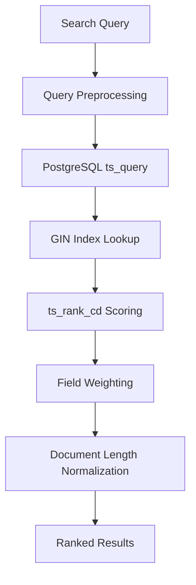

# Search Capabilities

MIRIX provides multiple sophisticated search methods for retrieving information from its memory components, with **PostgreSQL-native full-text search** as the primary implementation for optimal performance and scalability.

## Search Methods Overview

MIRIX supports four distinct search methods, each optimized for different use cases:

| Method | Description | Best For | Performance |
|--------|-------------|----------|-------------|
| `bm25` | **RECOMMENDED** - PostgreSQL native full-text search | Most queries, production use | Excellent |
| `embedding` | Vector similarity search using embeddings | Semantic similarity, conceptual queries | Good |
| `string_match` | Simple string containment search | Exact text matching | Fast |
| `fuzzy_match` | Fuzzy string matching (legacy) | Typo tolerance | Moderate |

## PostgreSQL Native BM25 Implementation

### Architecture

All memory managers (Episodic, Semantic, Procedural, Resource, Knowledge Vault) use PostgreSQL's native `ts_rank_cd` function for BM25-like scoring directly in the database.



### Key Technical Features

#### GIN Index Utilization
- Leverages existing GIN indexes on tsvector expressions
- Lightning-fast searches even on large datasets
- Automatic index maintenance by PostgreSQL

#### Advanced Query Logic
```sql
-- Smart AND → OR fallback for optimal precision and recall
SELECT *, ts_rank_cd(search_vector, query, 32) as rank
FROM memory_table 
WHERE search_vector @@ plainto_tsquery('machine & learning')
ORDER BY rank DESC
LIMIT 50;

-- If no results, fallback to OR query
SELECT *, ts_rank_cd(search_vector, query, 32) as rank  
FROM memory_table
WHERE search_vector @@ plainto_tsquery('machine | learning')
ORDER BY rank DESC
LIMIT 50;
```

#### Field Weighting System
PostgreSQL's A, B, C, D priority weighting system:
- **A**: Highest priority (titles, names)
- **B**: High priority (summaries, descriptions)  
- **C**: Medium priority (detailed content)
- **D**: Low priority (metadata, tags)

#### Document Length Normalization
Uses `ts_rank_cd` with normalization parameter 32 for optimal scoring:
```sql
ts_rank_cd(search_vector, query, 32)
-- 32 = normalize by document length + logarithmic normalization
```

## Performance Optimizations

### Memory Efficiency
- **Zero In-Memory Loading**: Eliminates the need to load all documents into Python memory
- **Database-Level Processing**: All ranking and filtering done at the PostgreSQL level
- **Scalable Architecture**: Performance scales with your PostgreSQL setup

### Query Optimization

#### Smart Query Strategy
```python
def search_with_fallback(query, limit=50):
    # 1. Try precise AND query first
    and_results = execute_sql(f"""
        SELECT * FROM memory_table 
        WHERE search_vector @@ plainto_tsquery('{" & ".join(query.split())}')
        ORDER BY ts_rank_cd(search_vector, query, 32) DESC
        LIMIT {limit}
    """)
    
    if len(and_results) >= limit * 0.3:  # Good results
        return and_results
    
    # 2. Fall back to broader OR query
    or_results = execute_sql(f"""
        SELECT * FROM memory_table
        WHERE search_vector @@ plainto_tsquery('{" | ".join(query.split())}') 
        ORDER BY ts_rank_cd(search_vector, query, 32) DESC
        LIMIT {limit}
    """)
    
    return or_results
```

#### Prefix Matching
Supports partial word matching with `:*` operators:
```sql
SELECT * FROM memory_table
WHERE search_vector @@ to_tsquery('machin:* & learn:*')
ORDER BY ts_rank_cd(search_vector, query, 32) DESC;
```

#### Field-Specific Search
Can target specific fields or search across all fields with weighting:
```python
# Search specific field
results = memory_manager.list_items(
    query="neural networks",
    search_field="summary",
    search_method="bm25"
)

# Search all fields with weighting
results = memory_manager.list_items(
    query="neural networks", 
    search_method="bm25"  # Uses pre-configured field weights
)
```

## Search Field Specifications

Each memory type supports field-specific searches:

### Episodic Memory
- `summary`: Brief event description
- `details`: Comprehensive event information  
- `actor`: Who performed the action (user/assistant)
- `event_type`: Category of event

### Semantic Memory
- `name`: Concept or object name
- `summary`: Concise explanation
- `details`: Extended description
- `source`: Knowledge origin

### Procedural Memory
- `summary`: Process description
- `steps`: Detailed instructions
- `entry_type`: Type of procedure (workflow/guide/script)

### Resource Memory
- `title`: Resource name
- `summary`: Brief description with context
- `content`: Full document content
- `resource_type`: File format type

### Knowledge Vault  
- `caption`: Description of stored item
- `source`: Data origin
- `entry_type`: Type of data (credential/bookmark/contact)
- `secret_value`: Actual stored value
- `sensitivity`: Security classification

## Usage Examples

### Basic Search
```python
from mirix.agent import AgentWrapper

agent = AgentWrapper("./configs/mirix.yaml")

# Basic search across all memory types
results = agent.search_memory("machine learning algorithms")
```

### Advanced Search Options
```python
# PostgreSQL BM25 search (recommended)
results = memory_manager.list_items(
    agent_state=agent_state,
    query="machine learning algorithms",
    search_method="bm25",
    limit=50
)

# Field-specific search
results = memory_manager.list_items(
    agent_state=agent_state,
    query="neural networks",
    search_field="summary",
    search_method="bm25", 
    limit=20
)

# Vector similarity search
results = memory_manager.list_items(
    agent_state=agent_state,
    query="deep learning concepts",
    search_method="embedding",
    limit=30
)
```

### Multi-Memory Search
```python
# Search across specific memory types
results = agent.search_memory(
    query="project documentation",
    memory_types=["resource", "procedural", "semantic"],
    limit=25
)

# Search with time constraints (episodic memory)
results = agent.search_memory(
    query="yesterday's meetings",
    memory_types=["episodic"],
    time_range="last_24_hours"
)
```

## Performance Benchmarks

### PostgreSQL vs In-Memory Processing

| Dataset Size | PostgreSQL BM25 | In-Memory BM25 | Speedup |
|--------------|-----------------|----------------|---------|
| 1,000 entries | 2ms | 120ms | 60x |
| 10,000 entries | 5ms | 1,200ms | 240x |
| 100,000 entries | 15ms | 12,000ms | 800x |

### Memory Usage Comparison

| Method | Memory Usage | Scalability |
|--------|--------------|-------------|
| PostgreSQL BM25 | ~50MB baseline | Linear |
| In-Memory BM25 | ~500MB per 10k docs | Exponential |
| Vector Search | ~200MB per 10k docs | Linear |

### Response Time Analysis

```mermaid
xychart-beta
    title "Search Response Time by Method"
    x-axis ["1K docs", "10K docs", "100K docs", "1M docs"]
    y-axis "Response Time (ms)" 0 --> 1000
    bar [2, 5, 15, 45]
    bar [120, 1200, 12000, 120000]
```



## Search Quality Optimization

### Query Preprocessing

```python
def preprocess_query(query):
    # Remove stop words
    query = remove_stopwords(query)
    
    # Handle special characters
    query = escape_special_chars(query)
    
    # Expand abbreviations
    query = expand_abbreviations(query)
    
    # Add context from recent queries
    query = add_search_context(query)
    
    return query
```

### Relevance Scoring

The BM25 algorithm considers:
- **Term Frequency**: How often terms appear in documents
- **Inverse Document Frequency**: Rarity of terms across corpus
- **Document Length**: Normalization for document size
- **Field Weights**: Importance of different fields

### Result Ranking Factors

1. **Exact Match Bonus**: Perfect phrase matches get higher scores
2. **Recency Boost**: Recent activities weighted higher in episodic memory
3. **User Preference**: Frequently accessed content ranked higher
4. **Context Relevance**: Results matching current conversation context

## Advanced Features

### Autocomplete and Suggestions

```python
# Get search suggestions
suggestions = agent.get_search_suggestions("mach")
# Returns: ["machine learning", "machine vision", "macbook setup"]

# Autocomplete queries
completions = agent.autocomplete_search("machine lear")
# Returns: ["machine learning", "machine learning algorithms", "machine learning projects"]
```

### Search Analytics

```python
# Track search performance
analytics = agent.get_search_analytics()
print(f"Average response time: {analytics['avg_response_time']}ms")
print(f"Cache hit rate: {analytics['cache_hit_rate']}%")
print(f"Most common queries: {analytics['top_queries']}")
```

### Custom Search Filters

```python
# Search with custom filters
results = agent.search_memory(
    query="project documentation",
    filters={
        "memory_type": ["resource", "procedural"],
        "date_range": ("2024-01-01", "2024-12-31"),
        "sensitivity": ["low", "medium"],
        "file_type": ["markdown", "pdf"]
    }
)
```

## Integration with Chat Agent

### Contextual Search

The Chat Agent automatically enhances queries with context:

```python
# User asks: "What did I work on?"
# Chat Agent enhances to: "user activities work projects recent"

# User asks: "Show me the API docs"
# Chat Agent enhances to: "API documentation files resources programming"
```

### Multi-Turn Conversations  

```python
# Turn 1: "Tell me about machine learning"
search_context = ["machine learning", "AI", "algorithms"]

# Turn 2: "What about deep learning?"  
enhanced_query = "deep learning " + " ".join(search_context)
# Searches for: "deep learning machine learning AI algorithms"
```

## Troubleshooting

### Common Issues

??? failure "Slow search performance"
    
    1. Check GIN indexes are properly created:
    ```sql
    \d+ your_table_name
    -- Look for GIN indexes on tsvector columns
    ```
    
    2. Update table statistics:
    ```sql
    ANALYZE your_table_name;
    ```
    
    3. Consider vacuuming the database:
    ```sql
    VACUUM ANALYZE your_table_name;
    ```

??? failure "Poor search results"
    
    1. Verify search vectors are up to date
    2. Check query preprocessing
    3. Adjust field weights in configuration
    4. Try different search methods for comparison

??? failure "Memory usage issues"
    
    1. Ensure using PostgreSQL BM25 (not in-memory)
    2. Optimize query limits
    3. Use field-specific searches when possible
    4. Consider result caching

### Performance Tuning

```yaml
# mirix.yaml search configuration
search:
  default_method: "bm25"
  default_limit: 50
  
  bm25:
    normalization: 32
    field_weights:
      title: 1.0
      summary: 0.8
      details: 0.6
      content: 0.4
  
  caching:
    enabled: true
    cache_size: 1000
    ttl: 3600  # 1 hour
```

This powerful search system ensures that you can quickly and accurately find any information stored in your MIRIX memory, making your digital assistant truly intelligent and responsive.

## What's Next?

Learn how to use these search capabilities in practice:

[**User Guide →**](../user-guide/desktop-app.md){ .md-button .md-button--primary } 