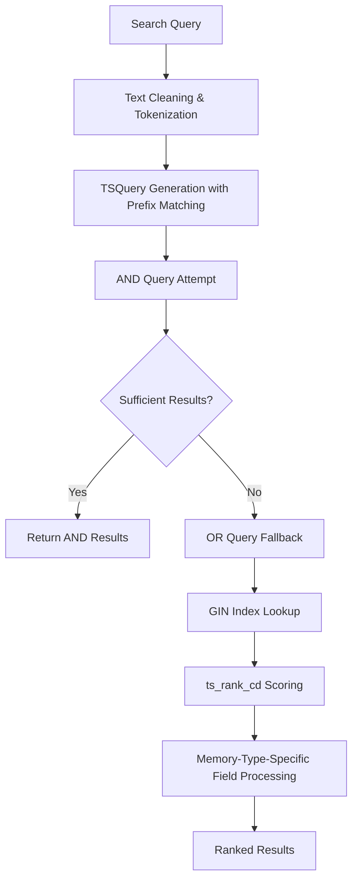

# Search Capabilities

MIRIX provides multiple sophisticated search methods for retrieving information from its **5 memory components** (Procedural, Knowledge Vault, Episodic, Semantic, Resource), with **PostgreSQL-native full-text search** as the primary implementation for optimal performance and scalability.

## Search Methods Overview

MIRIX supports three distinct search methods, each optimized for different use cases:

| Method | Description | Best For | Performance |
|--------|-------------|----------|-------------|
| `bm25` | **RECOMMENDED** - PostgreSQL native full-text search | Most queries, production use | Excellent |
| `embedding` | Vector similarity search using embeddings | Semantic similarity, conceptual queries | Good |
| `string_match` | Simple string containment search | Exact text matching | Fast |

## PostgreSQL Native BM25 Implementation

### Architecture

All 5 memory managers (Procedural, Knowledge Vault, Episodic, Semantic, Resource) use PostgreSQL's native `ts_rank_cd` function for BM25-like scoring directly in the database.



### Key Technical Features

#### Smart Query Preprocessing
- **Text Cleaning**: Removes punctuation, normalizes whitespace, converts to lowercase
- **Tokenization**: Splits into meaningful tokens, filters out very short words
- **TSQuery Creation**: Generates both exact and prefix matching queries for better recall
- **Special Character Escaping**: Safely handles PostgreSQL tsquery special characters

```python
# Example preprocessing flow
"machine-learning AI!" → "machine learning ai" → ["machine", "learning", "ai"]
→ "(machine | machine:*) & (learning | learning:*) & (ai | ai:*)"
```

#### Advanced Query Logic with Fallback
```sql
-- Step 1: Try precise AND query for high precision
SELECT *, ts_rank_cd(tsvector_field, to_tsquery('english', :and_query), 32) as rank
FROM memory_table 
WHERE tsvector_field @@ to_tsquery('english', :and_query)
ORDER BY rank DESC, created_at DESC
LIMIT 50;

-- Step 2: If insufficient results, fallback to OR query for better recall
SELECT *, ts_rank_cd(tsvector_field, to_tsquery('english', :or_query), 32) as rank  
FROM memory_table
WHERE tsvector_field @@ to_tsquery('english', :or_query)
ORDER BY rank DESC, created_at DESC
LIMIT 50;

-- Step 3: Ultimate fallback to simple ILIKE if tsquery fails
SELECT * FROM memory_table
WHERE lower(field) LIKE lower('%query%')
ORDER BY created_at DESC
LIMIT 50;
```

#### Memory-Type-Specific Field Implementation
Each memory type has different searchable fields and special handling:

**Procedural Memory Fields:**

- `summary`: Process description - `to_tsvector('english', coalesce(summary, ''))`
- `steps`: JSON array with special processing - `to_tsvector('english', coalesce(regexp_replace(steps::text, '[\"\\[\\],]', ' ', 'g'), ''))`
- `entry_type`: Type of procedure - `to_tsvector('english', coalesce(entry_type, ''))`

**Knowledge Vault Fields:**

- `caption`: Description of stored item - `to_tsvector('english', coalesce(caption, ''))`
- `secret_value`: Actual stored value - `to_tsvector('english', coalesce(secret_value, ''))`
- Additional: `entry_type`, `source`, `sensitivity` (with filtering support)

**Episodic Memory Fields:**

- `summary`: Brief event description - `to_tsvector('english', coalesce(summary, ''))`
- `details`: Comprehensive event information - `to_tsvector('english', coalesce(details, ''))`
- `actor`: Who performed the action - `to_tsvector('english', coalesce(actor, ''))`
- `event_type`: Category of event - `to_tsvector('english', coalesce(event_type, ''))`

**Semantic Memory Fields:**

- `name`: Concept or object name - `to_tsvector('english', coalesce(name, ''))`
- `summary`: Concise explanation - `to_tsvector('english', coalesce(summary, ''))`
- `details`: Extended description - `to_tsvector('english', coalesce(details, ''))`
- `source`: Knowledge origin - `to_tsvector('english', coalesce(source, ''))`

**Resource Memory Fields:**

- `title`: Resource name - `to_tsvector('english', coalesce(title, ''))`
- `summary`: Brief description - `to_tsvector('english', coalesce(summary, ''))`
- `content`: Full document content - `to_tsvector('english', coalesce(content, ''))`
- `resource_type`: File format type - `to_tsvector('english', coalesce(resource_type, ''))`

**Special JSON Array Handling (Procedural Memory Only):**
```sql
-- Transforms: ["step 1", "step 2", "step 3"]
-- Into: "step 1 step 2 step 3" for full-text search
regexp_replace(steps::text, '[\"\\[\\],]', ' ', 'g')
```

#### Field Weighting System (Multi-Field Search Only)
When no specific `search_field` is provided, each memory type uses different field weighting:

**Procedural Memory:**
```sql
setweight(to_tsvector('english', coalesce(summary, '')), 'A') ||
setweight(to_tsvector('english', coalesce(regexp_replace(steps::text, '[\"\\[\\],]', ' ', 'g'), '')), 'B') ||
setweight(to_tsvector('english', coalesce(entry_type, '')), 'C')
```

**Knowledge Vault (2-tier weighting):**
```sql
setweight(to_tsvector('english', coalesce(caption, '')), 'A') ||
setweight(to_tsvector('english', coalesce(secret_value, '')), 'B')
```

**Episodic Memory:**
```sql
setweight(to_tsvector('english', coalesce(summary, '')), 'A') ||
setweight(to_tsvector('english', coalesce(details, '')), 'B') ||
setweight(to_tsvector('english', coalesce(actor, '')), 'C') ||
setweight(to_tsvector('english', coalesce(event_type, '')), 'D')
```

**Semantic Memory:**
```sql
setweight(to_tsvector('english', coalesce(name, '')), 'A') ||
setweight(to_tsvector('english', coalesce(summary, '')), 'B') ||
setweight(to_tsvector('english', coalesce(details, '')), 'C') ||
setweight(to_tsvector('english', coalesce(source, '')), 'D')
```

**Resource Memory:**
```sql
setweight(to_tsvector('english', coalesce(title, '')), 'A') ||
setweight(to_tsvector('english', coalesce(summary, '')), 'B') ||
setweight(to_tsvector('english', coalesce(content, '')), 'C') ||
setweight(to_tsvector('english', coalesce(resource_type, '')), 'D')
```

**Note**: Field weighting is only applied during multi-field searches. Single-field searches directly query the specified field without weighting.

#### Special Features

**Knowledge Vault Sensitivity Filtering:**
Knowledge Vault has an additional `sensitivity` parameter for security-based filtering:
```python
# Filter by sensitivity levels
results = knowledge_vault_manager.list_knowledge(
    query="password",
    sensitivity=["low", "medium"]  # Exclude "high" sensitivity items
)
```

#### Document Length Normalization
Uses `ts_rank_cd` with normalization parameter 32 for optimal BM25-like scoring:
```sql
ts_rank_cd(search_vector, query, 32)
-- 32 = normalize by document length + use logarithmic normalization + unique word count
```


## Performance Optimizations

### Memory Efficiency
- **Zero In-Memory Loading**: Eliminates the need to load all documents into Python memory
- **Database-Level Processing**: All ranking and filtering done at the PostgreSQL level
- **Scalable Architecture**: Performance scales with your PostgreSQL setup

## Search Field Specifications

Each of the 5 memory types supports field-specific searches:

### Procedural Memory (Workflows & Procedures)
- `summary`: Process description
- `steps`: Detailed instructions (JSON array with special processing)
- `entry_type`: Type of procedure (workflow/guide/script)

### Knowledge Vault (Sensitive Information)
- `caption`: Description of stored item
- `secret_value`: Actual stored value (credentials, tokens, etc.)
- `entry_type`: Type of data (credential/bookmark/contact)
- `source`: Data origin
- `sensitivity`: Security classification (low/medium/high) - **supports filtering**

### Episodic Memory (Events & Activities)
- `summary`: Brief event description
- `details`: Comprehensive event information  
- `actor`: Who performed the action (user/assistant)
- `event_type`: Category of event

### Semantic Memory (Concepts & Knowledge)
- `name`: Concept or object name
- `summary`: Concise explanation
- `details`: Extended description
- `source`: Knowledge origin

### Resource Memory (Documents & Files)
- `title`: Resource name
- `summary`: Brief description with context
- `content`: Full document content
- `resource_type`: File format type (doc/markdown/pdf/etc.)

## Usage Examples

### Basic Search
```python
from mirix.agent import AgentWrapper

agent = AgentWrapper("./configs/mirix.yaml")

# Basic search across all memory types
results = agent.search_memory("machine learning algorithms")
```

### Memory-Type-Specific Search Examples
```python
# Procedural Memory - Find workflows
results = procedural_memory_manager.list_procedures(
    agent_state=agent_state,
    query="deployment process",
    search_method="bm25",
    search_field="summary",
    limit=20
)

# Knowledge Vault - Find credentials with sensitivity filtering
results = knowledge_vault_manager.list_knowledge(
    agent_state=agent_state,
    query="database password",
    search_method="bm25",
    sensitivity=["low", "medium"],  # Exclude high sensitivity
    limit=10
)

# Episodic Memory - Find recent activities
results = episodic_memory_manager.list_episodic_memory(
    agent_state=agent_state,
    query="code review",
    search_method="bm25",
    search_field="details",
    limit=15
)

# Semantic Memory - Find concepts
results = semantic_memory_manager.list_semantic_items(
    agent_state=agent_state,
    query="machine learning",
    search_method="embedding",
    search_field="name",
    limit=25
)

# Resource Memory - Find documents
results = resource_memory_manager.list_resources(
    agent_state=agent_state,
    query="API documentation",
    search_method="bm25",
    search_field="content",
    limit=30
)
```

## Advanced Features

### Special Memory-Type Features

**Knowledge Vault Sensitivity Filtering:**
```python
# Filter by sensitivity levels for security
results = knowledge_vault_manager.list_knowledge(
    query="database credentials",
    sensitivity=["low", "medium"]  # Exclude high sensitivity items
)
```

**Episodic Memory Time-Based Search:**
```python
# Search within specific time ranges
results = episodic_memory_manager.list_episodic_memory_around_timestamp(
    agent_state=agent_state,
    start_time=yesterday,
    end_time=today
)
```

**Procedural Memory JSON Array Processing:**
```python
# Search within step-by-step instructions
results = procedural_memory_manager.list_procedures(
    query="git deployment",
    search_field="steps",  # Searches within JSON array of steps
    search_method="bm25"
)
```
<!-- 

## Integration with Chat Agent

### Contextual Search

The Chat Agent automatically enhances queries with context:

```python
# User asks: "What did I work on?"
# Chat Agent enhances to: "user activities work projects recent"

# User asks: "Show me the API docs"
# Chat Agent enhances to: "API documentation files resources programming"
```
### Multi-Turn Conversations  

```python
# Turn 1: "Tell me about machine learning"
search_context = ["machine learning", "AI", "algorithms"]

# Turn 2: "What about deep learning?"  
enhanced_query = "deep learning " + " ".join(search_context)
# Searches for: "deep learning machine learning AI algorithms"
```
-->


## What's Next?

Learn how to use these search capabilities in practice:

[**User Guide →**](../legacy/user-guide/desktop-app.md){ .md-button .md-button--primary } 
