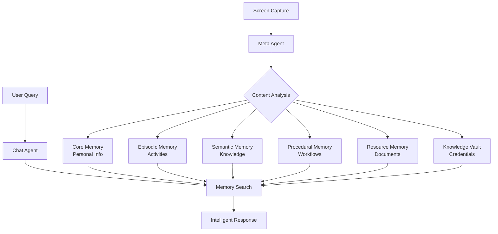

# Overview

Mirix leverages a unique multi-layered memory system comprising six distinct memory components and eight specialized agents, ensuring that data is processed efficiently and securely.

## What is Mirix?

**Mirix** is a multi-agent personal assistant designed to track on-screen activities and answer user questions intelligently. By capturing real-time visual data and consolidating it into structured memories, Mirix transforms raw inputs into a rich knowledge base that adapts to your digital experiences.

## Key Capabilities

### :material-eye: Intelligent Screen Tracking
- Takes screenshots every second
- Processes visual data in real-time
- Automatically consolidates information

### :material-brain: Multi-Agent Architecture
- **8 specialized agents** working collaboratively
- **6 memory components** for organized data storage
- Coordinated workflow for efficient processing

### :material-search-web: Advanced Search
- PostgreSQL-native BM25 search
- Vector similarity search using embeddings
- Fuzzy matching capabilities
- Field-specific search across all memory types

### :material-shield-check: Privacy & Security
- All long-term data stored locally
- User-controlled privacy settings
- Secure screenshot handling with automatic cleanup
- Enterprise-grade PostgreSQL security

## How Mirix Works

## Use Cases

!!! example "Digital Activity Tracking"
    
    Mirix automatically tracks your digital activities, from reading documents to browsing websites, creating a searchable timeline of your digital life.

!!! example "Context-Aware Assistance"
    
    Ask questions about your recent activities: "What was I reading about machine learning yesterday?" or "Where did I save that document about PostgreSQL?"

!!! example "Knowledge Management"
    
    Automatically extract and organize information from documents, websites, and applications you interact with.

!!! example "Workflow Documentation"
    
    Learn and remember your common workflows, making it easier to repeat complex tasks.

## System Requirements

- **Python 3.11** or later
- **PostgreSQL 17** (recommended) or SQLite
- **GEMINI API key**
- **4GB RAM** minimum, 8GB recommended
- **10GB free disk space**

## What's Next?

Ready to get started? Follow our step-by-step installation guide:

[**Installation Guide →**](installation.md){ .md-button .md-button--primary }

Or jump straight to using Mirix:

[**Quick Start →**](quick-start.md){ .md-button } 