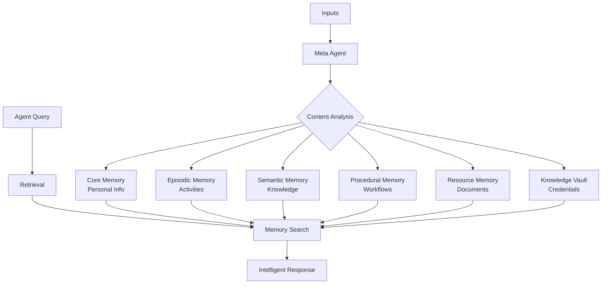

---
hide:
  - navigation
  - toc
---

# Welcome to MIRIX

**MIRIX** is a memory system for agents. It captures, structures, and retrieves memories so your agents can stay consistent over time.

<table>
  <tr>
    <td style="border-left: 6px solid #d35400; background: #fff3e0; padding: 12px;">
      <strong>Important Update: 0.1.6 (Main) vs 0.1.3 (Desktop Agent)</strong> 
      Starting with <code>0.1.6</code>, the <a href="https://github.com/Mirix-AI/MIRIX/tree/main"><code>main</code> branch</a> is a brand-new release line where Mirix is a pure memory system that can be plugged into any existing agents. The desktop personal assistant (frontend + backend) has been deprecated and is no longer shipped on <code>main</code>. If you need the earlier desktop application with the built-in agent, use the <a href="https://github.com/Mirix-AI/MIRIX/tree/desktop-agent"><code>desktop-agent</code> branch</a>.
    </td>
  </tr>
</table>

---

-   :material-rocket-launch:{ .lg .middle } **Get Started**

    ---

    Overview and a fast path to your first memory write.

    [:octicons-arrow-right-24: Overview](getting-started/overview.md)

-   :material-cog:{ .lg .middle } **Memory Write**

    ---

    Configure LLMs, embeddings, and retention policies.

    [:octicons-arrow-right-24: Configuration](memory-write/configuration.md)

-   :material-magnify:{ .lg .middle } **Memory Search**

    ---

    Query memories with keyword and embedding search.

    [:octicons-arrow-right-24: Search](memory-search/search.md)

-   :material-heart:{ .lg .middle } **Contributing**

    ---

    Learn how to contribute to the MIRIX project and join our community.

    [:octicons-arrow-right-24: Contribute](contributing.md)

---

## How MIRIX Works

## Use Cases

!!! example "Agent Memory"
    
    Persist key facts and decisions so agents remain consistent across sessions.

!!! example "Retrieval and Recall"
    
    Query episodic and semantic memory with keyword or embedding search.

!!! example "Structured Knowledge"
    
    Store procedures, resources, and core facts in dedicated memory types.

!!! example "Multi-Agent Systems"
    
    Plug MIRIX into different agents without rebuilding memory pipelines.

## System Requirements

- **Python 3.11** or later
- **PostgreSQL 17** (recommended) or SQLite
- An API key for your LLM provider

---

**Ready to add memory to your agents?**

[**Get Started Now**](getting-started/overview.md){ .md-button .md-button--primary }

## Key Capabilities

### :material-brain: Memory System
- Six memory components with dedicated agents
- Configurable retention and decay policies
- Structured writes from conversation input

### :material-brain: Multi-Agent Architecture
- **8 specialized agents** working collaboratively
- **6 memory components** for organized data storage
- Coordinated workflow for efficient processing

### :material-search-web: Advanced Search
- PostgreSQL-native BM25 search
- Vector similarity search using embeddings
- Field-specific search across all memory types

### :material-shield-check: Privacy & Security
- All long-term data stored locally
- User-controlled privacy settings
- Enterprise-grade PostgreSQL security
