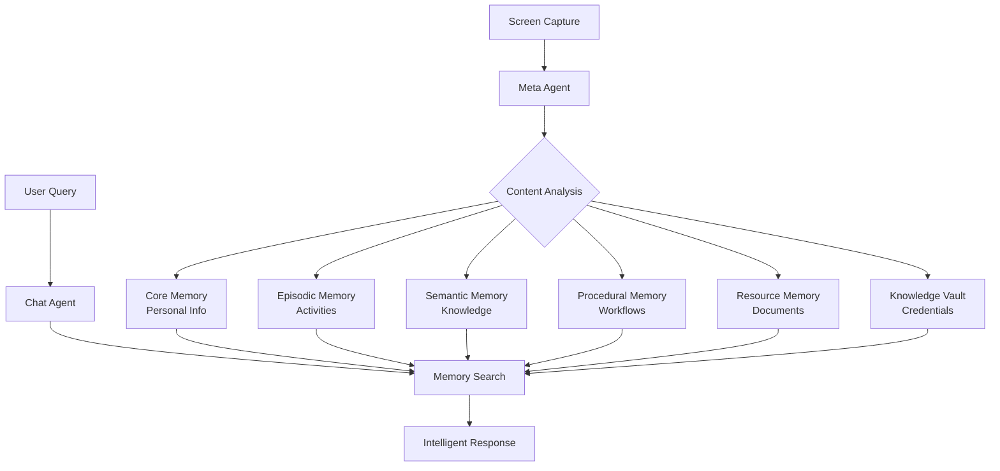

---
hide:
  - navigation
  - toc
---

# Welcome to MIRIX

**MIRIX** is a multi-agent personal assistant designed to track on-screen activities and answer user questions intelligently. By capturing real-time visual data and consolidating it into structured memories, MIRIX transforms your digital life into a visualizable memory.

---

-   :material-rocket-launch:{ .lg .middle } **Getting Started**

    ---

    Complete installation guide to get you up and running with MIRIX.

    [:octicons-arrow-right-24: Get Started](getting-started/installation.md)

-   :material-graph:{ .lg .middle } **Architecture**

    ---

    Learn about the multi-agent system, memory components, and search capabilities that power MIRIX.

    [:octicons-arrow-right-24: View Architecture](architecture/multi-agent-system.md)

-   :material-book-open-page-variant:{ .lg .middle } **User Guide**

    ---

    Comprehensive guides for using the desktop app, backend, and managing your memories.

    [:octicons-arrow-right-24: User Guide](user-guide/desktop-app.md)

-   :material-cog:{ .lg .middle } **Advanced**

    ---

    Advanced topics including backup & restore, performance optimization, and security settings.

    [:octicons-arrow-right-24: Advanced Topics](advanced/backup-restore.md)

-   :material-heart:{ .lg .middle } **Contributing**

    ---

    Learn how to contribute to the MIRIX project and join our community.

    [:octicons-arrow-right-24: Contribute](contributing.md)

---

## How MIRIX Works

## Use Cases

!!! example "Digital Activity Tracking"
    
    MIRIX automatically tracks your digital activities, from reading documents to browsing websites, creating a searchable timeline of your digital life.

!!! example "Context-Aware Assistance"
    
    Ask questions about your recent activities: "What was I reading about machine learning yesterday?" or "Where did I save that document about PostgreSQL?"

!!! example "Knowledge Management"
    
    Automatically extract and organize information from documents, websites, and applications you interact with.

!!! example "Workflow Documentation"
    
    Learn and remember your common workflows, making it easier to repeat complex tasks.

## System Requirements

- **Python 3.11** or later
- **Node.js 14** or later (for the desktop app)
- **PostgreSQL 17** (recommended) or SQLite
- **GEMINI API key** (We use GEMINI because it can load images from google cloud and the API is free to end users.)

---

**Ready to transform your digital experience with intelligent memory?**

[**Get Started Now →**](getting-started/installation.md){ .md-button .md-button--primary }

## Key Capabilities

### :material-eye: Intelligent Screen Tracking
- Takes screenshots every 1.5 seconds
- Processes visual data in real-time
- Automatically consolidates information

### :material-brain: Multi-Agent Architecture
- **8 specialized agents** working collaboratively
- **6 memory components** for organized data storage
- Coordinated workflow for efficient processing

### :material-search-web: Advanced Search
- PostgreSQL-native BM25 search
- Vector similarity search using embeddings
- Field-specific search across all memory types

### :material-shield-check: Privacy & Security
- All long-term data stored locally
- User-controlled privacy settings
- Secure screenshot handling with automatic cleanup
- Enterprise-grade PostgreSQL security 