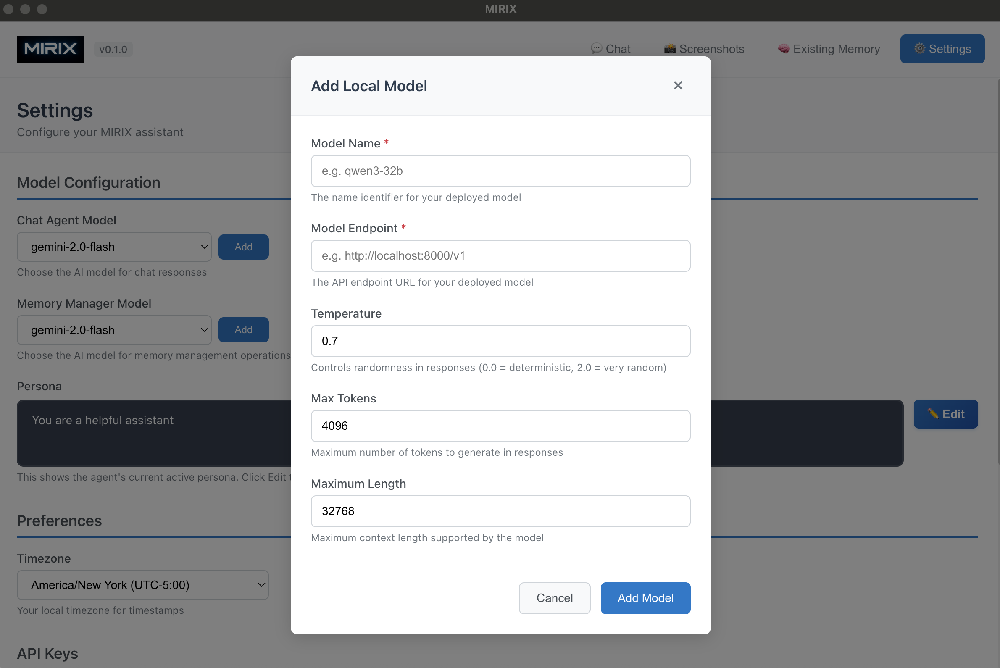

# Custom Models

Learn how to use custom models with MIRIX through vllm or other OpenAI-compatible API endpoints. This guide covers both end-user (Desktop App) and developer (Backend API) approaches.

## Overview

MIRIX supports using custom models served through vllm or other OpenAI-compatible API endpoints. This allows you to:

- Use your own fine-tuned models
- Deploy models on your own infrastructure
- Integrate with alternative model providers
- Optimize for specific use cases and hardware

Choose your approach:

- **[End-Users](#for-end-users-desktop-app)** - Use the Desktop App's graphical interface
- **[Developers](#for-developers-backend-api)** - Use configuration files and Python API

---

## For End-Users (Desktop App)

If you're using the MIRIX Desktop App, you can easily add custom models through the graphical interface without any configuration files.

### Step 1: Set Up vllm Model Server

First, serve your model using vllm. This step is the same for both end-users and developers:

```bash
# Example: Serving Qwen3-32B model with multi-GPU setup
CUDA_VISIBLE_DEVICES=0,1,2,3 \
python3 -m vllm.entrypoints.openai.api_server \
  --model Qwen/Qwen3-32B \
  --served-model-name qwen3-32b \
  --port 8001 \
  --tensor-parallel-size 4 \
  --max-model-len 32768 \
  --gpu-memory-utilization 0.9
```

**vllm Parameters Explained:**

| Parameter | Description | Example Value |
|-----------|-------------|---------------|
| `CUDA_VISIBLE_DEVICES` | Specify which GPUs to use | `0,1,2,3` |
| `--model` | HuggingFace model path or local model path | `Qwen/Qwen3-32B` |
| `--served-model-name` | Custom name for the served model | `qwen3-32b` |
| `--port` | Port to serve the API on | `8001` |
| `--tensor-parallel-size` | Number of GPUs for tensor parallelism | `4` |
| `--max-model-len` | Maximum sequence length | `32768` |
| `--gpu-memory-utilization` | GPU memory usage ratio (0.0-1.0) | `0.9` |

### Step 2: Add Model in Desktop App

Once your vllm server is running, add the model through the MIRIX Desktop App interface:



1. **Open Settings** - Navigate to **Settings** → **Model Configuration**
2. **Add Local Model** - Click the "Add" button next to either Chat Agent Model or Memory Manager Model
3. **Fill in Model Details** in the "Add Local Model" dialog:

| Field | Description | Example |
|-------|-------------|---------|
| **Model Name** | The name identifier for your deployed model | `qwen3-32b` |
| **Model Endpoint** | The API endpoint URL for your vllm server | `http://localhost:8001/v1` |
| **Temperature** | Controls randomness in responses (0.0-2.0) | `0.7` |
| **Max Tokens** | Maximum number of tokens to generate | `4096` |
| **Maximum Length** | Maximum context length supported | `32768` |

4. **Add Model** - Click "Add Model" to save the configuration
5. **Select Model** - Choose your newly added model from the dropdown
6. **Start Chatting** - Your custom model is now ready to use!

### UI Configuration Tips

!!! tip "Model Endpoint Format"
    
    Make sure your endpoint URL includes the `/v1` suffix:
    - ✅ Correct: `http://localhost:8001/v1`
    - ❌ Incorrect: `http://localhost:8001`

!!! note "Parameter Guidelines"
    
    - **Temperature**: Start with 0.7 for balanced responses
    - **Max Tokens**: Match your typical response length needs
    - **Maximum Length**: Should match your vllm `--max-model-len` setting

---

## For Developers (Backend API)

If you're using MIRIX programmatically through Python, you can configure custom models using YAML configuration files.

### Step 1: Set Up vllm Model Server

Use the same vllm server setup as shown in the [End-Users section](#step-1-set-up-vllm-model-server) above.

### Step 2: Create Custom Model Configuration

Create a custom configuration file in your `configs/` directory (e.g., `configs/mirix_custom_model.yaml`):

```yaml
agent_name: mirix
model_name: qwen3-32b
model_endpoint: http://localhost:8001/v1
generation_config:
  temperature: 0.6
  max_tokens: 4096
  context_window: 32768
```

### Step 3: Configuration Parameters

| Parameter | Description | Example |
|-----------|-------------|---------|
| `agent_name` | Name identifier for your agent | `mirix` |
| `model_name` | Model name as served by vllm | `qwen3-32b` |
| `model_endpoint` | API endpoint URL | `http://localhost:8001/v1` |
| `system_prompt_folder` | (Optional) Custom system prompt folder path | `/path/to/system_prompt` |
| `temperature` | Controls response randomness (0.0-1.0) | `0.6` |
| `max_tokens` | Maximum tokens in response | `4096` |
| `context_window` | Maximum context length | `32768` |

### Step 4: Initialize Agent with Custom Model

```python
from mirix.agent import AgentWrapper

# Initialize agent with custom model configuration
agent = AgentWrapper("./configs/mirix_custom_model.yaml")
```


## Supported Model Types

MIRIX supports any model that provides an OpenAI-compatible API, including:

- **Local Models** - Models served locally with vllm, Ollama, or other servers
- **Self-hosted Models** - Models deployed on your own infrastructure  
- **Custom Endpoints** - Any OpenAI-compatible API endpoint
- **Different Providers** - Alternative model providers with OpenAI-compatible APIs

## Complete Example: Developer Workflow

Here's a complete end-to-end example for developers using the Python API:

```python
# 1. Start vllm server (in terminal)
# CUDA_VISIBLE_DEVICES=0,1,2,3 python3 -m vllm.entrypoints.openai.api_server \
#   --model Qwen/Qwen3-32B --served-model-name qwen3-32b --port 8001 \
#   --tensor-parallel-size 4 --max-model-len 32768 --gpu-memory-utilization 0.9

# 2. Create configuration file
custom_config = """
agent_name: mirix_qwen
model_name: qwen3-32b
model_endpoint: http://localhost:8001/v1
generation_config:
  temperature: 0.7
  max_tokens: 8192
  context_window: 32768
"""

# Save to configs/mirix_custom_model.yaml

# 3. Initialize and use
from mirix.agent import AgentWrapper

agent = AgentWrapper("./configs/mirix_custom_model.yaml")
response = agent.send_message("Hello! What model are you running on?")
print("Custom Model Response:", response)
```

## Advanced Configuration

### Multiple Model Configurations

You can create different configuration files for different models:

```bash
configs/
├── mirix_qwen_32b.yaml      # Large model for complex tasks
├── mirix_qwen_7b.yaml       # Smaller model for quick responses
└── mirix_custom_local.yaml  # Local fine-tuned model
```

### Model-Specific Optimizations

Different models may require different configurations:

```yaml
# For code generation models
agent_name: mirix_code
model_name: codellama-34b
model_endpoint: http://localhost:8002/v1
generation_config:
  temperature: 0.1  # Lower temperature for code
  max_tokens: 8192
  context_window: 16384

---
# For creative writing models
agent_name: mirix_creative
model_name: llama2-70b
model_endpoint: http://localhost:8003/v1
generation_config:
  temperature: 0.9  # Higher temperature for creativity
  max_tokens: 4096
  context_window: 32768
```

### Custom System Prompts

MIRIX allows you to customize the system prompts used by your agent by specifying a custom system prompt folder in your configuration file.

#### Configuration

Add the `system_prompt_folder` parameter to your YAML configuration:

```yaml
agent_name: mirix
model_name: qwen3-32b
model_endpoint: http://localhost:8001/v1
system_prompt_folder: /path/to/system_prompt
generation_config:
  temperature: 0.6
  max_tokens: 4096
  context_window: 32768
```

#### System Prompt Folder Structure

The `system_prompt_folder` parameter should point to a directory containing your custom system prompt files. These prompts define how your agent behaves and responds.

**Available prompt files:**

```bash
/path/to/system_prompt
  ├── background_agent.txt        # Background processing agent prompt
  ├── chat_agent.txt              # Main chat agent prompt
  ├── core_memory_agent.txt       # Core memory management prompt
  ├── episodic_memory_agent.txt   # Episodic memory prompt
  ├── knowledge_vault_agent.txt   # Knowledge vault prompt
  ├── meta_memory_agent.txt       # Meta memory manager prompt
  ├── procedural_memory_agent.txt # Procedural memory prompt
  ├── reflexion_agent.txt         # Reflexion agent prompt
  ├── resource_memory_agent.txt   # Resource memory prompt
  └── semantic_memory_agent.txt   # Semantic memory prompt
```

!!! tip "Flexible Customization"
    
    All prompt files are optional. You can customize only the agents you want to modify - MIRIX will use the default prompts for any files not found in your custom folder. This allows you to selectively override specific agent behaviors without needing to provide all 10 files.

#### Example Configuration

```python
from mirix.agent import AgentWrapper

# Initialize agent with custom system prompts
agent = AgentWrapper("./configs/mirix_custom_prompts.yaml")
```

**Configuration file (`configs/mirix_custom_prompts.yaml`):**

```yaml
agent_name: mirix_debug
model_name: gemini-2.0-flash
system_prompt_folder: debug/base_debug  # Custom prompt folder
generation_config:
  temperature: 0.7
  max_tokens: 4096
  context_window: 8192
```

## Troubleshooting

### Common Issues

!!! failure "Connection refused errors"
    
    Check if your vllm server is running:
    ```bash
    # Check if the port is in use
    lsof -i :8001
    
    # Check vllm server logs
    tail -f /path/to/vllm/logs
    ```

!!! failure "Out of memory errors"
    
    Adjust GPU memory utilization:
    ```bash
    # Reduce memory utilization
    --gpu-memory-utilization 0.8
    
    # Use smaller tensor parallel size
    --tensor-parallel-size 2
    ```

!!! failure "Model loading errors"
    
    Verify model path and permissions:
    ```bash
    # Check if model exists locally
    ls -la /path/to/local/model/
    
    # Check HuggingFace cache
    ls ~/.cache/huggingface/transformers/
    ```

### Performance Optimization

!!! tip "GPU Configuration"
    
    For optimal performance:
    - Use all available GPUs with tensor parallelism
    - Set `gpu-memory-utilization` to 0.85-0.95
    - Match `max-model-len` to your actual needs

!!! tip "Memory Management"
    
    Monitor system resources:
    ```bash
    # Monitor GPU usage
    nvidia-smi -l 1
    
    # Monitor system memory
    htop
    ```

## Important Considerations

!!! warning "Model Compatibility"
    
    Ensure your custom model is compatible with the tasks you want to perform. Some models may work better for chat, while others excel at specific tasks like code generation or analysis.

!!! info "Performance Considerations"
    
    Local model performance depends on your hardware. Consider factors like:
    - GPU memory requirements
    - Model size vs. inference speed
    - Context window vs. memory usage
    - Network latency for remote endpoints

!!! note "Security"
    
    When using custom endpoints:
    - Ensure secure connections (HTTPS) for remote servers
    - Validate API authentication if required
    - Monitor for unusual usage patterns

## Quick Reference

### Which Approach Should I Use?

| Use Case | Recommended Approach | Why |
|----------|---------------------|-----|
| **Regular MIRIX Desktop App user** | [End-Users (Desktop App)](#for-end-users-desktop-app) | Easy graphical interface, no configuration files needed |
| **Python developer building integrations** | [Developers (Backend API)](#for-developers-backend-api) | Programmatic control, configuration files, automation |
| **Both desktop and programmatic use** | Start with Desktop App, then use Backend API | Best of both worlds |

### Essential Steps (Both Approaches)

1. **Start vllm server** with your model
2. **Configure in MIRIX** (UI dialog OR YAML file)
3. **Start using** your custom model

## What's Next?

Ready to explore more MIRIX features?

[**Multi-User Support →**](multi-user.md){ .md-button .md-button--primary } 