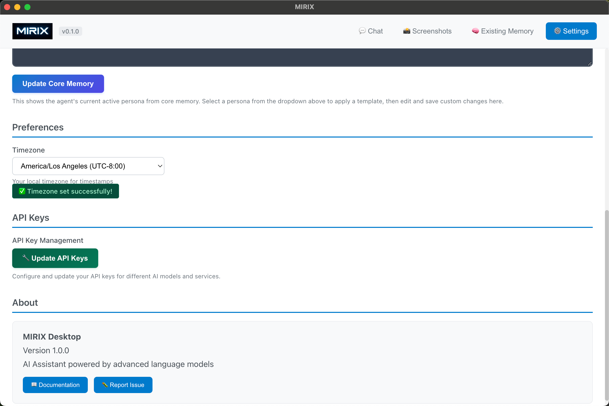

# Desktop App Guide

The MIRIX Desktop App provides a user-friendly graphical interface for interacting with your personal AI assistant and managing your digital memories. This comprehensive desktop application offers advanced features for chat interaction, screen monitoring, memory management, and data visualization.

## Overview

MIRIX Desktop is your central hub for AI-powered personal assistance, featuring:

- **Interactive Chat Interface** - Natural conversation with your AI assistant
- **Screen Monitoring** - Let your assistant observe and understand your screen activity
- **Advanced Settings** - Configure AI models, personas, and preferences
- **Memory Visualization** - Explore and understand your stored memories
- **Data Management** - Export and import your memory data

## Chat Interface

The main chat window is where you interact with your MIRIX assistant. Features include:

- **Real-time Conversations** - Ask questions and get intelligent responses
- **Context Awareness** - Your assistant remembers previous conversations
- **Multi-turn Dialogue** - Engage in complex, ongoing discussions
- **Helpful Responses** - Get assistance with tasks, questions, and planning

### Getting Started with Chat

1. Launch the MIRIX Desktop App
2. Click the **Chat** tab to open the conversation interface
3. Type your message in the input field at the bottom
4. Press Enter or click Send to interact with your assistant

## Screen Monitoring

The Screen Monitor feature allows your MIRIX assistant to observe your screen activity, providing contextual assistance based on what you're doing.

### Features:

- **Real-time Screen Capture** - Continuous monitoring of your desktop
- **Smart Analysis** - AI understanding of your current activities
- **Contextual Assistance** - Get help based on what's on your screen
- **Privacy Controls** - Full control over when monitoring is active

### How to Use Screen Monitoring:

1. Navigate to the **Screenshots** tab
2. Click **Start Monitor** to begin screen capture
3. The status will show "monitoring" when active
4. View captured screenshots and their timestamps
5. Click **Stop Monitor** when you want to disable the feature

**Privacy Note**: You have complete control over screen monitoring. The feature only captures screenshots when explicitly enabled and can be stopped at any time.

## Settings & Configuration

Customize your MIRIX experience through the comprehensive Settings panel.

### Model Configuration

**Chat Agent Model:**

- **OpenAI Models** - GPT-4, GPT-3.5-turbo, and other OpenAI models
- **Gemini Models** - Google's Gemini Pro and Flash models
- Choose the model that best fits your needs and preferences

**Memory Manager Model:**

- **Gemini Models Only** - Currently supports Gemini models for memory operations
- Optimized for understanding and organizing your personal data

### Persona Customization

Configure your assistant's personality and behavior:

- **Template Selection** - Choose from predefined persona templates
- **Custom Persona** - Write your own persona description
- **Active Persona Display** - See your current assistant's personality in the "Agent's Active Persona (Core Memory)" section
- **Update Core Memory** - Apply changes to your assistant's personality

### Timezone Settings

Set your local timezone to help your assistant understand:

- **Time Context** - When events occur in your local time
- **Activity Patterns** - Your daily routines and schedules  
- **Temporal References** - Accurate interpretation of time-based queries

**To Configure Timezone:**

1. Go to Settings → Preferences → Timezone
2. Select your timezone from the dropdown menu
3. Confirmation will appear when successfully set

## Memory Management & Visualization

MIRIX builds and maintains different types of memories about your activities and interactions. The memory management interface lets you explore and understand how your assistant perceives and organizes information about you.

### Memory Types

- **📚 Episodic** - Personal experiences and events from your life
- **🧠 Semantic** - Facts and general knowledge you've discussed
- **⚙️ Procedural** - Skills, procedures, and how-to knowledge
- **📁 Resource** - Files, documents, and reference materials
- **⭐ Core** - Fundamental personality and preference information
- **🔐 Credentials** - Secure authentication and access information

### Memory Views

**List View:**

- Browse memories chronologically
- See memory details and timestamps
- Search through your memory collection

**Tree View:**

- Visualize memory relationships and connections
- Understand how concepts link together
- Explore memory hierarchies and associations

### Memory Search

Use the search functionality to:

- Find specific memories quickly
- Filter by memory type or date
- Locate relevant information across your personal knowledge base

## Data Export & Import

MIRIX provides powerful options for managing your memory data.

### Export Options

**Excel Export:**

- Export selected memory types to `.xlsx` format
- Separate sheets for each memory type
- Comprehensive data including timestamps and details
- Choose export location on your system

**Supported Export Formats:**

- All memory types can be exported simultaneously
- Individual memory type selection available
- Structured data format for easy analysis

### Import Options

**Upload Memory Data:**

- Import memories from external sources
- Mock upload functionality for testing
- Integrate data from other platforms or backups

**Agent Memory Platform:**

- Connect to MIRIX's blockchain-based memory platform
- Secure, decentralized storage of your memories
- Cross-device synchronization capabilities

### How to Export Your Memories:

1. Click **Existing Memory** tab
2. Select **Upload & Export** button
3. Choose which memory types to export (Episodic, Semantic, Procedural, Resource)
4. Set your export file path or browse to select location
5. Click **Export Memories** to generate your Excel file

## What's Next?

Ready to dive deeper? Explore these advanced topics:

[**Backend Usage →**](backend-usage.md){ .md-button .md-button--primary }
[**Custom Models →**](custom-models.md){ .md-button } 