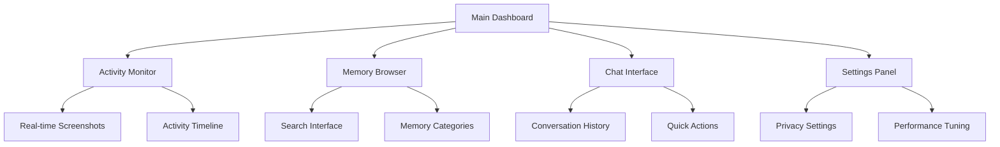

# Desktop App Guide

The Mirix Desktop App provides a user-friendly graphical interface for interacting with your personal assistant and managing your digital activities.

!!! info "Coming Soon"
    
    The desktop application is currently under development. This guide will be updated as features become available.

## Overview

The desktop app will offer:

- **Real-time Activity Monitoring**: Visual dashboard of your current activities
- **Memory Explorer**: Browse and search through your stored memories
- **Chat Interface**: Natural language conversations with your assistant
- **Privacy Controls**: Manage screenshot capture and data retention settings
- **System Notifications**: Stay informed about important activities and insights

## Expected Features

### Main Dashboard



### Activity Monitoring
- **Live Screenshot Feed**: See what Mirix is capturing in real-time
- **Activity Timeline**: Visual timeline of your digital activities
- **Processing Status**: Monitor memory consolidation and agent activity
- **Performance Metrics**: System resource usage and processing statistics

### Memory Management
- **Visual Memory Browser**: Explore your six memory components
- **Advanced Search Interface**: Use all search methods with visual filters
- **Memory Statistics**: See memory usage and organization
- **Export/Import Tools**: Backup and restore your memories

### Chat Interface
- **Rich Text Conversations**: Natural language chat with formatting support
- **Context Awareness**: See what memories are being accessed for responses
- **Multi-modal Input**: Send text, images, and voice messages
- **Conversation History**: Browse and search past conversations

### Privacy & Security
- **Screenshot Controls**: Enable/disable capture for specific applications
- **Memory Retention Policies**: Set automatic cleanup rules
- **Sensitivity Management**: Control access to sensitive information
- **Activity Exclusions**: Exclude specific activities from tracking

## Current Workaround: Backend Usage

While the desktop app is in development, you can use the backend directly for full functionality.

### Python Interface

```python
from mirix.agent import AgentWrapper

# Initialize the agent
agent = AgentWrapper("./configs/mirix.yaml")

# Send information to process
agent.send_message(
    message="Working on documentation for Mirix",
    image_uris=["/path/to/screenshot.png"],
    force_absorb_content=True
)

# Chat with your assistant
response = agent.send_message("What have I been working on today?")
print(response)
```

### Command Line Interface

```bash
# Start Mirix in background mode
python main.py --daemon

# Send a message via CLI
python -c "
from mirix.agent import AgentWrapper
agent = AgentWrapper('./configs/mirix.yaml')
print(agent.send_message('What did I work on yesterday?'))
"
```

## Development Status

### Planned Features

- [ ] **Desktop Application Framework**: Electron or native Python GUI
- [ ] **Real-time Activity Dashboard**: Live monitoring interface
- [ ] **Memory Browser**: Visual exploration of memories
- [ ] **Chat Interface**: Rich conversation experience
- [ ] **Settings Panel**: Configuration management
- [ ] **System Tray Integration**: Background operation
- [ ] **Notifications**: Smart alerts and insights
- [ ] **Backup/Restore GUI**: Visual data management

### Timeline

!!! note "Development Roadmap"
    
    The desktop app is planned for release in Q2 2025. Follow our [GitHub repository](https://github.com/Mirix-AI/Mirix) for development updates.

## Contributing

Interested in helping build the desktop app? We welcome contributions:

- **UI/UX Design**: Help design the user interface
- **Frontend Development**: Build the application interface
- **Backend Integration**: Connect the GUI to the Mirix backend
- **Testing**: Help test and improve the user experience

Contact us at `yuw164@ucsd.edu` or open an issue on GitHub to get involved.

## Alternative Interfaces

### Web Interface (Planned)

A web-based interface is also planned, which will provide:
- Browser-based access to Mirix
- Real-time updates via WebSocket
- Mobile-responsive design
- Cloud deployment options

### API Integration

For developers who want to integrate Mirix into their own applications:

```python
# Example API integration
from mirix.api import MirixAPI

api = MirixAPI(config_path="./configs/mirix.yaml")

# Get recent activities
activities = api.get_activities(limit=10, time_range="today")

# Search memories
results = api.search_memories("machine learning", limit=20)

# Send new information
api.absorb_content("Working on a new AI project", images=["screenshot.png"])
```

## What's Next?

While waiting for the desktop app, learn how to use Mirix through the backend:

[**Backend Usage →**](backend-usage.md){ .md-button .md-button--primary }

Or explore advanced features:

[**Memory Management →**](memory-management.md){ .md-button } 