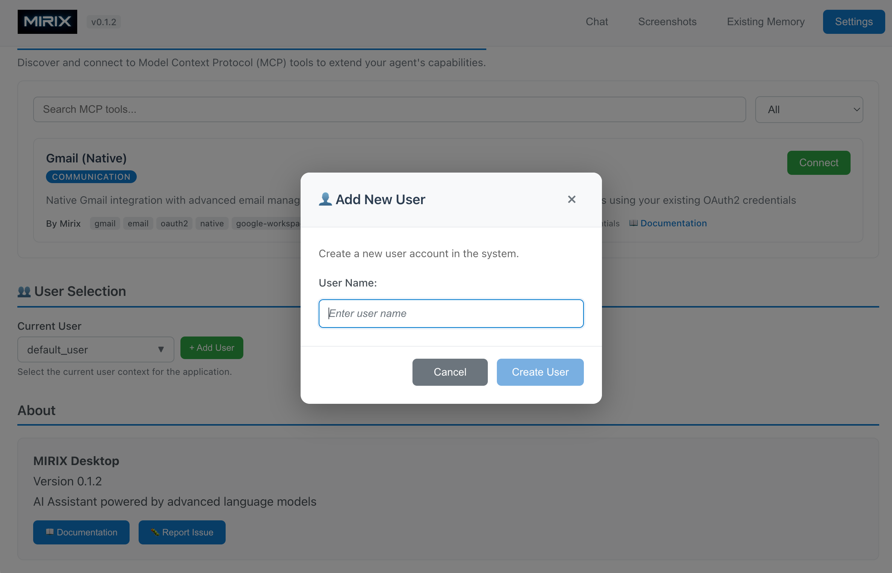

# Multi-User Support

MIRIX provides comprehensive multi-user support, allowing you to maintain separate memory contexts and conversations for different users or use cases. This is particularly useful for shared environments, family usage, or managing distinct projects with isolated memory contexts.

## Overview

Multi-user functionality in MIRIX enables:

- **Isolated Memory Contexts** - Each user has their own private memory storage
- **Separate Conversation Histories** - Independent chat sessions per user
- **Flexible User Management** - Easy creation and switching between users
- **Secure Isolation** - User data remains completely separate and private

Choose your approach:

- **[For End-Users](#for-end-users-desktop-app)** - Use the Desktop App's graphical interface
- **[For Developers](#for-developers-sdk-api)** - Use the Python SDK for programmatic control

---

## For End-Users (Desktop App)

The MIRIX Desktop App provides an intuitive interface for managing multiple users without any coding required.

### Adding a New User



1. **Open User Management** - Navigate to the **User Selection** section in the Settings
2. **Click Add User** - Click the green **"+ Add User"** button
3. **Enter User Details** in the "Add New User" dialog:
   - **User Name**: Enter a unique identifier for the new user (e.g., "Alice", "Work", "Personal")
4. **Create User** - Click **"Create User"** to add the new user to the system
5. **Select User** - The new user will appear in the dropdown menu

### Switching Between Users

Once you have multiple users created:

1. **Open Current User Dropdown** - Click on the current user selection dropdown (shows "default_user" initially)
2. **Select Different User** - Choose any user from the list
3. **Context Switch** - The application will immediately switch to that user's memory context and conversation history

### User Context Isolation

Each user maintains completely separate:

- **Memory Storage** - Personal information, experiences, and knowledge
- **Conversation History** - Chat sessions and interactions
- **Preferences** - Settings and customizations
- **File Associations** - Documents and resources linked to memories

!!! note "User Privacy"
    
    User contexts are completely isolated. Information added for one user will not be visible or accessible to other users, ensuring privacy and data separation.

### Use Cases for Multiple Users

**Family Sharing:**
```
- "Dad" - Work-related memories and conversations
- "Mom" - Personal interests and activities  
- "Kids" - Educational content and homework help
```

**Work/Personal Separation:**
```
- "Work" - Professional projects and meetings
- "Personal" - Hobbies, travel, and personal interests
```

**Project Management:**
```
- "Project_A" - Specific project context and resources
- "Project_B" - Different project with separate requirements
- "Research" - Academic or research-focused activities
```

---

## For Developers (SDK & API)

The MIRIX Python SDK provides full programmatic control over multi-user functionality for automated workflows and custom applications.

### Basic Multi-User Operations

#### Creating and Managing Users

```python
from mirix import Mirix
import os
from dotenv import load_dotenv

load_dotenv()

# Initialize memory agent
memory_agent = Mirix(api_key=os.getenv("GEMINI_API_KEY"))

# List existing users
users = memory_agent.list_users()
print(f"Existing users: {[user.name for user in users]}")

# The default user is always available
default_user = users[0]
assert default_user.name == "default_user"

# Create a new user
alice = memory_agent.create_user(user_name="Alice")
print(f"Created user: {alice.name} with ID: {alice.id}")

# Create additional users
bob = memory_agent.create_user(user_name="Bob")
work_user = memory_agent.create_user(user_name="Work_Context")
```

#### User-Specific Memory Operations

```python
# Add memories for specific users
memory_agent.add("John loves Italian food and is allergic to peanuts", user_id=default_user.id)
memory_agent.add("John likes to eat British food", user_id=alice.id)
memory_agent.add("Team meeting every Monday at 9 AM", user_id=work_user.id)

# Query memories from specific user contexts
response_default = memory_agent.chat("What does John like to eat?", user_id=default_user.id)
print(f"Default user response: {response_default}")
# Output: "John loves Italian food. However, he's allergic to peanuts."

response_alice = memory_agent.chat("What does John like to eat?", user_id=alice.id)
print(f"Alice's response: {response_alice}")
# Output: "John likes to eat British food."

response_work = memory_agent.chat("When is our team meeting?", user_id=work_user.id)
print(f"Work context response: {response_work}")
# Output: "The team meeting is every Monday at 9 AM."
```

### SDK User Management

#### Complete User Lifecycle

```python
from mirix import Mirix

# Initialize with environment variables
memory_agent = Mirix(api_key=os.getenv("GEMINI_API_KEY"))

# Create users for different contexts
project_user = memory_agent.create_user(user_name="ProjectX")
personal_user = memory_agent.create_user(user_name="Personal")

# Set up project-specific memories
project_memories = [
    "Project X uses React and Node.js",
    "Database is PostgreSQL hosted on AWS",
    "Team lead is Sarah Johnson",
    "Sprint review every Friday at 3 PM"
]

for memory in project_memories:
    memory_agent.add(memory, user_id=project_user.id)

# Set up personal memories  
personal_memories = [
    "Favorite restaurant is Chez Laurent",
    "Gym membership at 24 Hour Fitness",
    "Doctor appointment next Tuesday",
    "Planning vacation to Japan in spring"
]

for memory in personal_memories:
    memory_agent.add(memory, user_id=personal_user.id)

# Use different contexts appropriately
work_query = memory_agent.chat("What technology stack are we using?", user_id=project_user.id)
personal_query = memory_agent.chat("Where should I go for dinner?", user_id=personal_user.id)

print(f"Work context: {work_query}")
print(f"Personal context: {personal_query}")
```

## What's Next?

Ready to dive deeper into MIRIX development?

[**Performance →**](../advanced/performance.md){ .md-button .md-button--primary }
